# Business Logic Model: Unit 1 - Backend Persistence & 5-Phase Security Pipeline

## 1. Sequence Flow of the 5-Phase Pipeline

```mermaid
sequenceDiagram
    autonumber
    actor User as Usuário / Cockpit
    participant Server as Express Server
    participant Pipe as Security Pipeline Orchestrator
    participant DB as SQLite DB
    participant Socket as Socket.IO (project_channel)

    User->>Server: POST /api/projects/:id/security/scan
    Server->>Pipe: triggerPhasePipeline(projectId)
    Server-->>User: 202 Accepted { running: true }

    rect rgb(20, 25, 40)
        Note over Pipe,Socket: Fase 1: Mapeamento de Rotas & Headers
        Pipe->>Socket: emit("security_phase_progress", Phase 1)
    end

    rect rgb(30, 20, 35)
        Note over Pipe,Socket: Fase 2: Varredura de Segredos (.env)
        Pipe->>Socket: emit("security_phase_progress", Phase 2)
    end

    rect rgb(45, 15, 25)
        Note over Pipe,Socket: Fase 3: Simulação Red Team (OWASP)
        Pipe->>Socket: emit("security_phase_progress", Phase 3)
    end

    rect rgb(15, 35, 40)
        Note over Pipe,Socket: Fase 4: Defesas Blue Team (Mitigações)
        Pipe->>Socket: emit("security_phase_progress", Phase 4)
    end

    rect rgb(15, 40, 25)
        Note over Pipe,DB: Fase 5: Consolidação & Gravação
        Pipe->>DB: UPDATE projects SET security_score, security_rating, last_security_audit_at
        Pipe->>Socket: emit("security_phase_progress", Phase 5 Complete)
        Pipe->>Socket: emit("security_updated", { summary })
    end
```



---

## 2. Score Calculation Algorithm
O cálculo de score de segurança é estritamente determinístico:

$$\text{deduções} = \sum_{f \in \text{findings}} \text{penalty}(f.\text{status}, f.\text{severity})$$

Onde as penalidades são:
* **Status Open**:
  * Critical: $-25$ pts
  * High: $-15$ pts
  * Medium: $-8$ pts
  * Low: $-3$ pts
* **Status Mitigating**:
  * Critical: $-12$ pts
  * High: $-7$ pts
  * Medium: $-4$ pts
  * Low: $-1$ pts
* **Status Mitigated / Verified**:
  * $0$ pts deduzidos

$$\text{score} = \max(0, \min(100, 100 - \text{deduções}))$$

A classificação de letras (*rating*) obedece:
* $\text{score} \ge 95 \implies \text{'A+'}$
* $\text{score} \ge 85 \implies \text{'A'}$
* $\text{score} \ge 75 \implies \text{'B'}$
* $\text{score} \ge 60 \implies \text{'C'}$
* $\text{score} < 60 \implies \text{'F'}$

---

## 3. Atomic Database Synchronization
Ao concluir a Fase 5, a transação ou statement executa:
```sql
UPDATE projects 
SET security_score = ?, security_rating = ?, last_security_audit_at = CURRENT_TIMESTAMP 
WHERE id = ?;
```
Dessa forma, qualquer cliente que execute `GET /api/projects/:id` ou recarregue a página lê imediatamente os dados persistidos, sem necessitar aguardar a query de agregação de findings.
