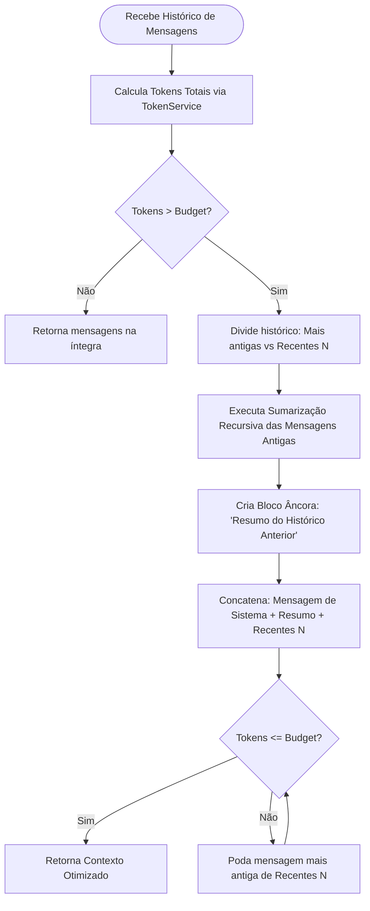
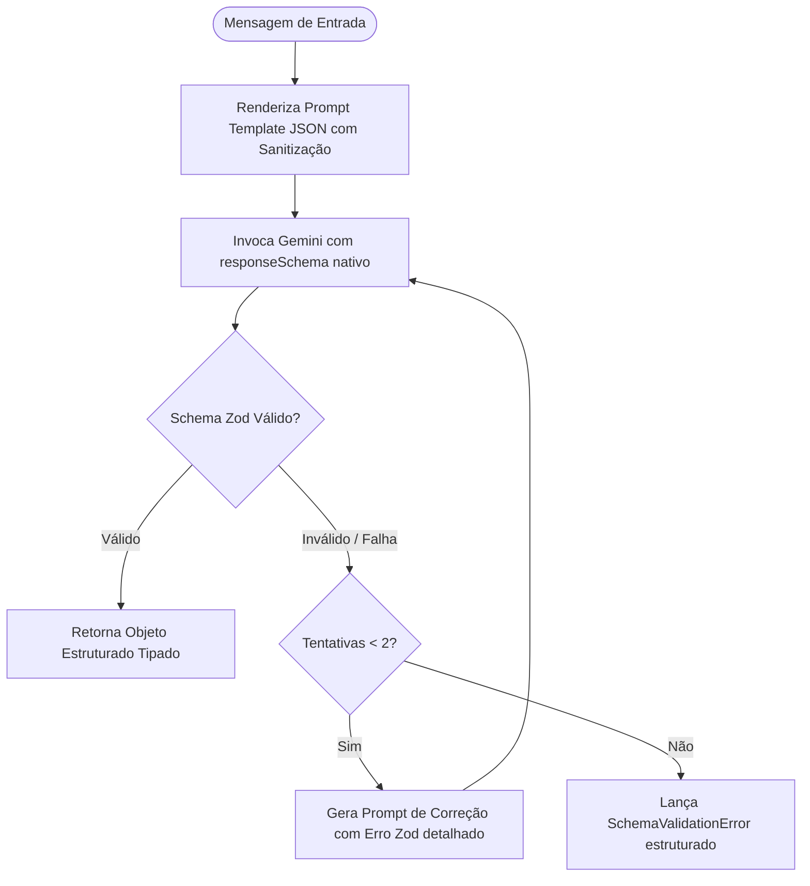
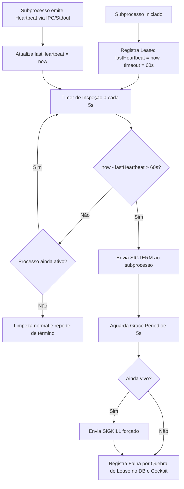

# Business Logic Model - Unit 1: Infraestrutura de LLM & Segurança

## 1. Overview
A Unit 1 estabelece a camada de infraestrutura de LLM, blindagem contra injeção de prompt, gestão inteligente de contexto (sliding window com condensação recursiva) e resiliência de subprocessos por heartbeat renovável.

---

## 2. Core Business Workflows

### 2.1 Recursive Auto-Summarization & Sliding Window (US-6)
Ao preparar o contexto para o LLM em um projeto ativo:

### 2.2 Structured Output with Reflection Loop (US-5)
Processamento determinístico para triagem de mensagens e extração de prioridade:

### 2.3 Prompt Registry & Hot-Reload (US-7)
- Prompts desacoplados armazenados em arquivos `.json` estruturados em `packages/server/prompts/`.
- Cada arquivo contém:
  - `role`: Identificador do papel (ex: `supervisor`, `security`, `qa`, `triage`).
  - `description`: Finalidade do prompt.
  - `model`: Configuração sugerida (modelo, temperatura).
  - `messages`: Array de mensagens contendo `role` (`system` | `user` | `assistant`) e `template` com placeholders como `${projectName}`, `${context}`.
- O `PromptRegistry` mantém cache em memória com checagem de mtime ou invalidação dinâmica para hot-reload imediato sem necessidade de rebuild ou reinício do servidor.

### 2.4 Resilient Heartbeat Lease Manager (US-8)
Gerenciamento de tarefas longas no Bridge Daemon:

