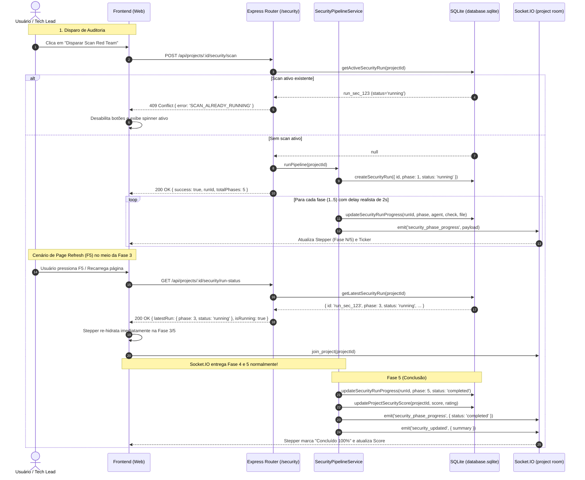

# Business Logic Model: Unit 1 - Backend SQLite Schema (`security_runs`), Persistence & Lockout

## 1. Sequence Diagram: Scan Execution, Persistence & Refresh Re-connection



---

## 2. Assinaturas de Métodos no `queries.ts`

```typescript
// 1. Criar novo registro de execução
export function createSecurityRun(data: {
  id: string;
  projectId: string;
  phase?: number;
  totalPhases?: number;
  phaseName: string;
  status?: 'running' | 'completed' | 'failed';
  agentRole: 'delta-security' | 'beta-backend' | 'system';
  agentName: string;
  currentCheck?: string;
  targetFile?: string;
  findingsCount?: number;
  score?: number | null;
}): SecurityRun;

// 2. Atualizar progresso de fase
export function updateSecurityRunProgress(
  runId: string,
  updates: Partial<Omit<SecurityRun, 'id' | 'project_id' | 'started_at'>>
): SecurityRun | null;

// 3. Buscar o run mais recente (ativo ou concluído)
export function getLatestSecurityRun(projectId: string): SecurityRun | null;

// 4. Buscar run ativo (status = 'running')
export function getActiveSecurityRun(projectId: string): SecurityRun | null;
```

---

## 3. Endpoints REST da Unit 1

### A. `GET /api/projects/:projectId/security/run-status`
- **Finalidade**: Re-idratação do frontend no load da página, F5 e alternância de abas.
- **Resposta 200 OK**:
  ```json
  {
    "success": true,
    "projectId": "travel_fun",
    "isRunning": true,
    "latestRun": {
      "id": "run_sec_1790726369_a8f1",
      "project_id": "travel_fun",
      "phase": 3,
      "total_phases": 5,
      "phase_name": "Simulação Adversarial OWASP (Red Team)",
      "status": "running",
      "agent_role": "delta-security",
      "agent_name": "Delta (Security - Red Team)",
      "current_check": "Simulando injeção NoSQL, bypass de autenticação e timing attacks...",
      "target_file": "src/routes/security.ts",
      "findings_count": 5,
      "score": 75,
      "started_at": "2026-09-29 21:05:00",
      "updated_at": "2026-09-29 21:05:04",
      "completed_at": null
    }
  }
  ```

### B. `POST /api/projects/:projectId/security/scan` (Evoluído com Lockout 409)
- **Verificação de Entrada**:
  - Consulta `queries.getActiveSecurityRun(projectId)` e `pipeline.isScanRunning(projectId)`.
  - Se ativo: retorna `409 Conflict` imediatamente com dados do run em andamento.
  - Se livre: inicia novo run no banco e em background com delay realista de 2.000ms a 2.500ms por etapa.
