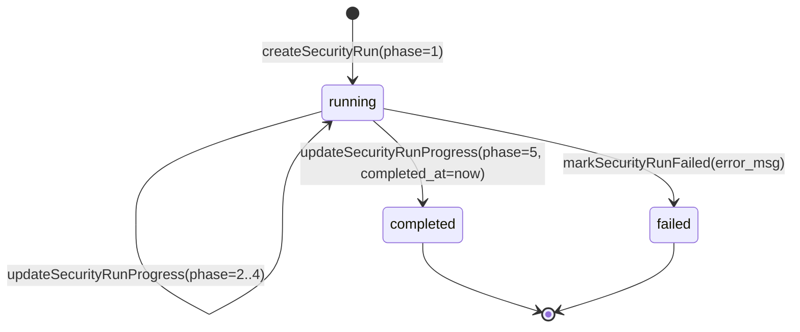

# Domain Entities: Unit 1 - Backend SQLite Schema (`security_runs`), Persistence & Lockout

## 1. Entidade `SecurityRun` (Tabela `security_runs`)

Representa uma execução individual do pipeline determinístico de segurança, rastreando seu ciclo de vida completo do início até a conclusão ou falha.

### Schema SQLite (DDL)
```sql
CREATE TABLE IF NOT EXISTS security_runs (
  id TEXT PRIMARY KEY,                       -- ID único da execução (ex: run_sec_1790726369_a8f1)
  project_id TEXT NOT NULL,                  -- ID do projeto associado
  phase INTEGER NOT NULL DEFAULT 1,          -- Fase atual (1 a 5, ou 0 em erro)
  total_phases INTEGER NOT NULL DEFAULT 5,   -- Total de fases do pipeline (5)
  phase_name TEXT NOT NULL,                  -- Nome amigável da fase ativa
  status TEXT NOT NULL DEFAULT 'running',    -- 'running' | 'completed' | 'failed'
  agent_role TEXT NOT NULL,                  -- 'delta-security' | 'beta-backend' | 'system'
  agent_name TEXT NOT NULL,                  -- Nome do agente (ex: Delta (Security - Red Team))
  current_check TEXT,                        -- Descrição da verificação técnica em andamento
  target_file TEXT,                          -- Arquivo sob inspeção naquele momento
  findings_count INTEGER DEFAULT 0,          -- Achados computados até a fase
  score INTEGER DEFAULT NULL,                -- Score parcial ou final
  started_at DATETIME DEFAULT CURRENT_TIMESTAMP,
  updated_at DATETIME DEFAULT CURRENT_TIMESTAMP,
  completed_at DATETIME DEFAULT NULL,
  FOREIGN KEY (project_id) REFERENCES projects(id) ON DELETE CASCADE
);

CREATE INDEX IF NOT EXISTS idx_security_runs_project_status ON security_runs(project_id, status);
CREATE INDEX IF NOT EXISTS idx_security_runs_project_created ON security_runs(project_id, started_at DESC);
```

### TypeScript Interface (`packages/server/src/db/queries.ts`)
```typescript
export interface SecurityRun {
  id: string;
  project_id: string;
  phase: number;
  total_phases: number;
  phase_name: string;
  status: 'running' | 'completed' | 'failed';
  agent_role: 'delta-security' | 'beta-backend' | 'system';
  agent_name: string;
  current_check: string | null;
  target_file: string | null;
  findings_count: number;
  score: number | null;
  started_at: string;
  updated_at: string;
  completed_at: string | null;
}
```

---

## 2. Máquina de Estados de `SecurityRun`



### Invariantes de Estado:
1. **Unicidade de Execução Ativa**: Em qualquer instante de tempo, para um determinado `project_id`, existe no máximo **1** registro com `status = 'running'`.
2. **Monotonicidade de Fases**: Um run com `status = 'running'` progride estritamente na sequência $1 \le phase \le 5$.
3. **Consistência de Conclusão**: `status = 'completed'` implica necessariamente `phase = 5` e `completed_at IS NOT NULL`.
