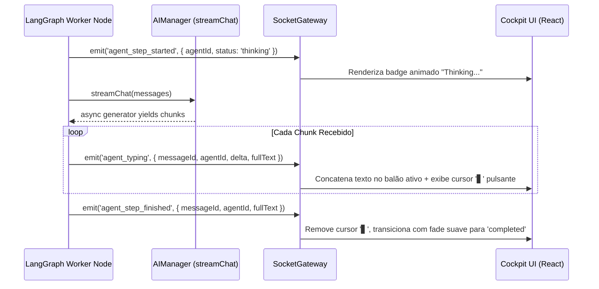

# Business Logic Model - Unit 2: Cockpit Streaming & Auto-Recovery UI

## 1. Overview
A Unit 2 estabelece o fluxo de ponta a ponta para streaming em tempo real no Cockpit, feedback visual de raciocínio (Thinking & Typing) e resiliência com notificações não-intrusivas de Auto-Recovery com backoff exponencial adaptativo.

---

## 2. Core Workflows

### 2.1 Real-Time Streaming & Typing Lifecycle (US-1)


### 2.2 Adaptive Auto-Recovery & Backoff Flow (US-2, US-3)
```mermaid
flowchart TD
    Invoke[Chamada LLM iniciada] --> TryCall{Executa chamada}
    
    TryCall -- Sucesso --> Success[Retorna resposta e prossegue fluxo]
    
    TryCall -- Falha (Erro detectado) --> InspectError{Inspeciona tipo de erro}
    
    InspectError -- "Contém Retry-After (Header/Msg)" --> UseHeader[delay = retryAfterMs]
    InspectError -- "429 / Resource Exhausted" --> Base10s[baseDelay = 10.000ms]
    InspectError -- "503 / Network / Overloaded" --> Base2s[baseDelay = 2.000ms]
    
    Base10s --> CalcBackoff[delay = baseDelay * 2^(attempt-1) ± Jitter]
    Base2s --> CalcBackoff
    UseHeader --> EmitToast
    CalcBackoff --> EmitToast[Socket emite 'agent_recovery' com status 'retrying']
    
    EmitToast --> CockpitToast[Cockpit exibe Floating Toast com contagem regressiva]
    CockpitToast --> WaitDelay[Aguarda delayMs com timer visual]
    
    WaitDelay --> NextAttempt{attempt < 5?}
    NextAttempt -- Sim --> TryCall
    
    NextAttempt -- Não (Esgotou 5 tentativas) --> EmitExhausted[Socket emite 'agent_recovery' status 'exhausted']
    EmitExhausted --> PauseGraph[Pausa LangGraph com Interrupt: 'waiting_human']
    PauseGraph --> CockpitModal[Cockpit exibe Modal de Intervenção Humana]
```
