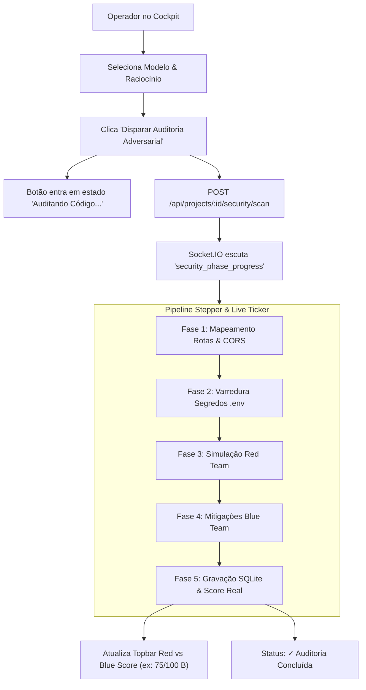

# Business Logic Model: Unit 2 - Cockpit UI Overhaul & Expressive Status

## 1. Governance Panel Interaction Flow

---

## 2. Dynamic Live Ticker Logic
O ticker exibe dinamicamente:
* **Fase Ativa**: `Fase X de 5` acompanhado de barra de progresso visual de 5 segmentos com gradiente esmeralda/índigo.
* **Agente e Ação**:
  * Em execução: `[Nome do Agente] targetFile: currentCheck` com ponto pulsante âmbar/ciano.
  * Concluído: `✓ Auditoria Concluída: Score persistido no banco` com ponto verde fixo.
  * Idle: `Pronto para Auditoria Adversarial` com ponto cinza.
