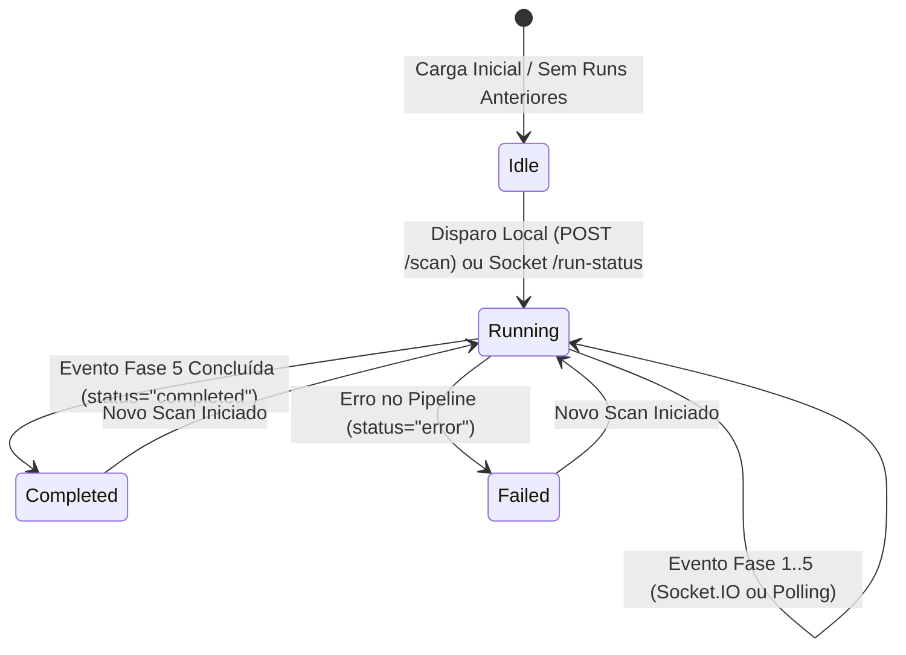
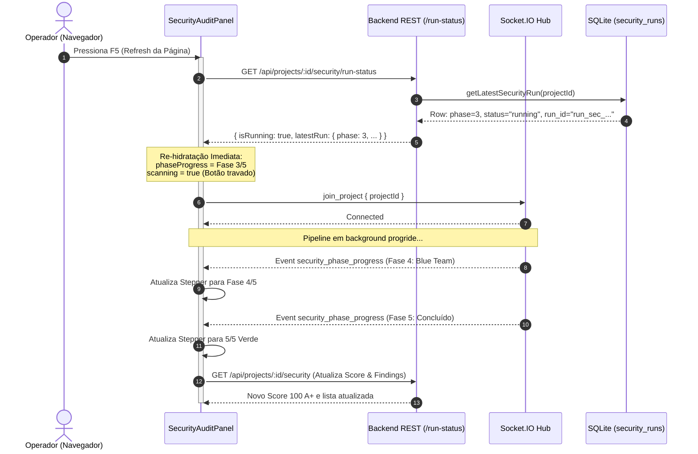
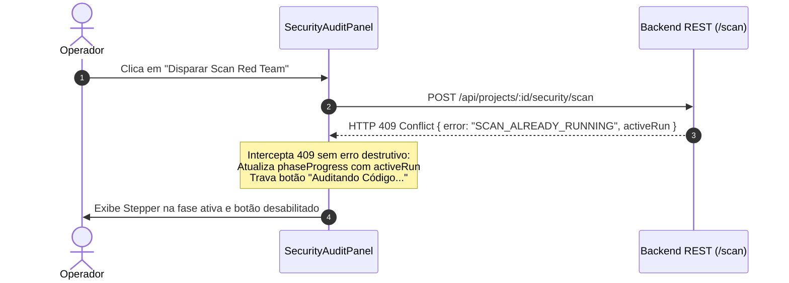

# Business Logic Model: Unit 2 - Universal Stepper, Re-hidratação Pós-Refresh & Lockout Visual

## 1. Máquina de Estados do Stepper no Cliente

O componente visual `SecurityStepper` e os painéis de consumo operam sob a seguinte máquina de estados determinística:

### Descrição dos Estados
1. **Idle ("Pronto para Auditoria")**: Nenhuma auditoria ativa. Exibe as 5 barras cinzas e o timestamp do último scan realizado. Botão habilitado.
2. **Running ("Auditando...")**: Auditoria em progresso. A barra da fase atual pulsa em âmbar brilhante, as anteriores ficam verdes e as futuras ficam cinzas. O ticker mostra agente, arquivo e teste. Botão desabilitado com spinner.
3. **Completed ("Concluído")**: As 5 barras ficam verdes brilhantes. O ticker exibe "✓ Auditoria Concluída: Score X/100 persistido". Botão habilitado para novos scans.
4. **Failed ("Erro")**: A barra falhada é indicada em vermelho. Ticker alerta sobre o problema. Botão reabilitado.

---

## 2. Diagrama de Sequência: Re-hidratação Pós-Refresh (F5)

O cenário crítico reportado pelo usuário — dar refresh ou alternar abas durante uma auditoria — é resolvido com o seguinte fluxo:

---

## 3. Diagrama de Sequência: Bloqueio Concorrente com HTTP 409

Se o usuário tentar disparar um scan enquanto outro já está em execução:

---

## 4. Mapeamento de Props e Fluxo de Dados

| Campo UI | Fonte WebSocket (`security_phase_progress`) | Fonte REST (`/run-status`) | Fallback Inicial |
|---|---|---|---|
| `phase` | `data.phase` | `latestRun.phase` | `0` (Idle) ou `5` (se concluído) |
| `totalPhases` | `data.totalPhases` (5) | `latestRun.total_phases` (5) | `5` |
| `phaseName` | `data.phaseName` | `latestRun.phase_name` | `"Pronto para Auditoria"` |
| `currentCheck` | `data.currentCheck` | `latestRun.current_check` | `""` |
| `targetFile` | `data.targetFile` | `latestRun.target_file` | `undefined` |
| `scoreSoFar` | `data.scoreSoFar` | `latestRun.score` | `project.security_score` |
| `status` | `data.status` | `latestRun.status` | `'idle'` |
| `isScanning` | `data.status === 'running'` | `isRunning \|\| status === 'running'` | `false` |
