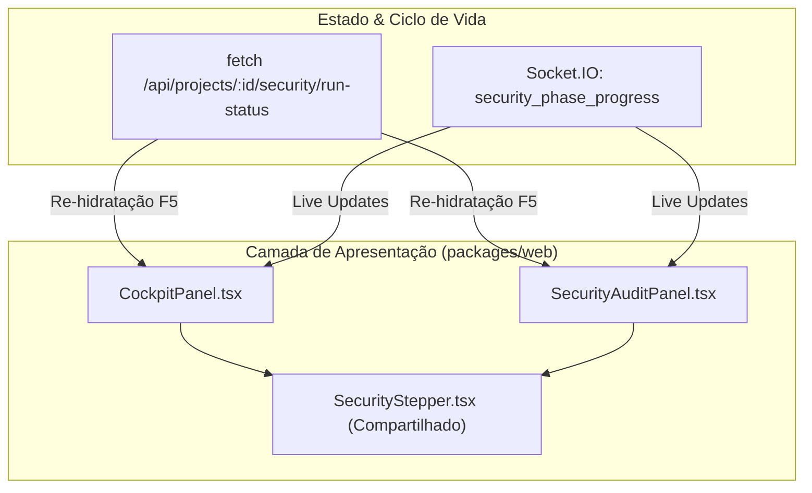

# Frontend Components: Unit 2 - Universal Stepper, Re-hidratação Pós-Refresh & Lockout Visual

## 1. Visão Geral da Arquitetura Frontend
A Unit 2 soluciona a desconexão visual entre o painel de governança superior e a aba analítica (`SecurityAuditPanel`), introduzindo um componente modular e reutilizável (`SecurityStepper.tsx`), eliminando timeouts fictícios legados (`setTimeout(3000)`) e garantindo re-hidratação atômica do estado via API REST `/run-status` e Socket.IO.



---

## 2. Especificação dos Componentes

### 2.1. Novo Componente: `SecurityStepper.tsx`
- **Arquivo**: `packages/web/src/components/SecurityStepper.tsx`
- **Finalidade**: Componente visual compartilhado que renderiza o roteiro determinístico de 5 fases e o ticker de inspeção em tempo real.
- **Props**:
  ```typescript
  export interface SecurityStepperProps {
    phaseProgress: SecurityPhaseProgressPayload | null;
    isScanning?: boolean;
    compact?: boolean;
    lastAuditAt?: string | null;
    title?: string;
  }
  ```
- **Estrutura de Fases Determinísticas (5 Passos)**:
  1. `1. Rotas & CORS` (Delta Security - Validação de endpoints abertos e regras CORS)
  2. `2. Segredos .env` (Delta Security - Varredura de credenciais e API keys no código)
  3. `3. Red Team (OWASP)` (Delta Security - Testes de injeção, SQLi, command injection e path traversal)
  4. `4. Blue Team (Patch)` (Beta Backend - Aplicação de patches, sanitização e defesas)
  5. `5. Verificação & DB` (Beta & Delta - Cálculo final do score e persistência no SQLite)

- **Comportamento Visual por Fase**:
  - **Fase Ativa (`status === 'running'`)**: Barra na cor âmbar brilhante (`bg-amber-400 animate-pulse shadow-[0_0_8px_rgba(251,191,36,0.5)]`), rótulo em `text-amber-300 font-bold`.
  - **Fase Concluída (`isPast || status === 'completed'`)**: Barra verde esmeralda (`bg-emerald-500 shadow-[0_0_8px_rgba(16,185,129,0.5)]`), rótulo em `text-zinc-400`.
  - **Fase Futura/Pendente**: Barra neutra cinza escuro (`bg-zinc-800`), rótulo em `text-zinc-600`.
- **Mini-Ticker Dinâmico**:
  - `status === 'running'`: Dot pulsante âmbar (`animate-ping bg-amber-400`), badge "Fase X/5: {phaseName}", exibição do arquivo alvo (`targetFile` em `text-cyan-400 font-semibold`) e teste em execução (`currentCheck` em `text-zinc-300`).
  - `status === 'completed'`: Dot fixo esmeralda (`bg-emerald-400`), mensagem "✓ Auditoria Concluída: Score {scoreSoFar}/100 persistido".
  - `status === 'failed' | 'error'`: Dot vermelho (`bg-rose-400`), mensagem "✕ Falha na Auditoria de Segurança".
  - `idle`: Dot cinza (`bg-zinc-600`), horário do último scan formatado ou "Pronto para Auditoria".

---

### 2.2. Atualização: `SecurityAuditPanel.tsx`
- **Arquivo**: `packages/web/src/components/SecurityAuditPanel.tsx`
- **Alterações**:
  1. **Inclusão do Stepper Universal**:
     - Renderiza `<SecurityStepper />` diretamente entre o banner superior (Score + Botão) e a grade de cards de severidade.
     - Permite ao operador inspecionar os 5 passos determinísticos antes, durante e após qualquer auditoria, mesmo com a aba "Auditoria Red Team vs. Blue Team" isolada.
  2. **Re-hidratação Pós-Refresh (F5)**:
     - Adiciona chamada `GET /api/projects/:projectId/security/run-status` dentro do `useEffect` de montagem.
     - Se `latestRun` retornar `status === 'running'`, re-hidrata o estado:
       - `setScanning(true)`
       - `setPhaseProgress(...)` mapeando os campos do SQLite.
     - Se `latestRun` retornar `status === 'completed'`, exibe o stepper na Fase 5 concluída com o score correspondente.
  3. **Escuta de WebSocket em Tempo Real**:
     - Adiciona handler `socket.on('security_phase_progress', (data) => ...)`:
       - Atualiza `phaseProgress` continuamente a cada 2 segundos conforme o backend progride.
       - Quando `data.status === 'completed'`: desliga `scanning = false`, atualiza o resumo completo chamando `fetchSecurityData()`.
       - Quando `data.status === 'error'`: desliga `scanning = false`.
  4. **Eliminação de Timeout Fictício**:
     - **Remoção total** de `setTimeout(..., 3000)` em `handleTriggerScan`. O botão não desativa mais de forma arbitrária; seu ciclo de vida é estritamente controlado pelos eventos de conclusão do pipeline.
  5. **Tratamento de Bloqueio Concorrente (HTTP 409 Conflict)**:
     - Se `POST /scan` retornar status 409 (`data.error === 'SCAN_ALREADY_RUNNING'`), o cliente não falha; ele captura o `data.activeRun`, sincroniza `phaseProgress` e mantém os controles bloqueados transparentemente.

---

### 2.3. Atualização: `CockpitPanel.tsx`
- **Arquivo**: `packages/web/src/components/CockpitPanel.tsx`
- **Alterações**:
  1. **Re-hidratação no Carregamento Inicial**:
     - Consulta `GET /api/projects/:projectId/security/run-status` na carga inicial e a cada ciclo de polling (4s).
     - Evita que um F5 no cockpit faça o stepper perder o progresso de um scan em andamento.
  2. **Substituição pelo `<SecurityStepper />`**:
     - Substitui a marcação JSX inline duplicada pela instância do `<SecurityStepper />`, garantindo fidelidade e comportamento idêntico entre o Cockpit e a aba de Segurança.
  3. **Bloqueio Idempotente dos Botões**:
     - O botão de scan no cockpit também reage ao `phaseProgress?.status === 'running'` e desabilita adequadamente.
