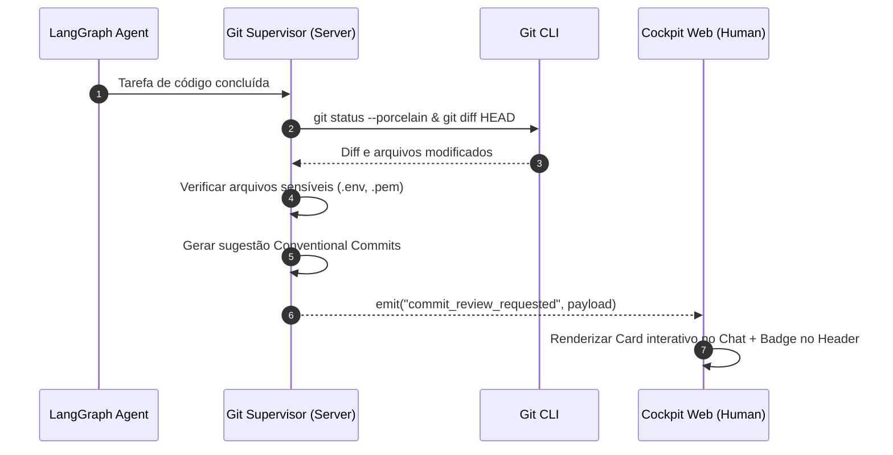

# Business Logic Model - Unit 3: Git Supervisor & Commit Approval

## 1. Architecture & Responsibilities
O módulo **Git Supervisor & Commit Approval** é responsável por fechar o ciclo de governança do AI-DLC. Ele garante que qualquer código gerado ou modificado por agentes autônomos (Alpha Frontend, Beta Backend, Gama QA, etc.) seja submetido à aprovação expressa do Human Supervisor antes de ser integrado ao histórico do Git.

---

## 2. Core Workflows

### 2.1 Workflow 1: Inspeção de Modificações e Geração de Diff
1. **Trigger**:
   - Agente de IA finaliza a execução de uma tarefa de código no LangGraph (`createAgentWorkerNode`).
   - Ou o operador humano clica no botão "Inspecionar Git" no Cockpit.
2. **Coleta de Alterações**:
   - O backend executa `git status --porcelain` no diretório do projeto.
   - Caso haja novos arquivos não rastreados, executa `git add -N .` (intent-to-add sem modificar índices binários de forma destrutiva).
   - Executa `git diff HEAD` (com fallback para `git diff` se o repositório estiver no commit inicial) para extrair o Unified Diff.
3. **Auditoria de Segurança (Security Baseline)**:
   - Os arquivos modificados são comparados contra a lista de arquivos sensíveis:
     - `.env*`, `*.pem`, `*.key`, `credentials.json`, `id_rsa*`, etc.
   - Se qualquer arquivo sensível for detectado, o status é marcado como `BLOCKED_BY_SECURITY` e o botão de commit fica desabilitado no frontend, exigindo que o arquivo seja removido ou adicionado ao `.gitignore`.
4. **Geração Semântica da Mensagem (Conventional Commits)**:
   - Se o contexto possuir uma tarefa associada (ex: "Criar componente de login"), a mensagem sugerida é formulada semanticamente: `feat(auth): add login component and authentication handlers`.
   - Se for refatoração ou correção: `fix(...)` ou `refactor(...)`.
5. **Emissão de Evento**:
   - O backend emite via Socket.IO o evento `commit_review_requested` contendo o payload completo de `CommitApprovalRequest`.

---

### 2.2 Workflow 2: Aprovação e Execução Segura do Commit
1. O operador clica no botão "Revisar Diff" no card do chat ou no header.
2. O `GitDiffModal` se abre com suporte a:
   - Visualização Side-by-Side ou Unified.
   - File accordions com contadores de adições (+) e deleções (-).
   - Checkboxes de revisão "Viewed" por arquivo.
   - Campo editável de mensagem de commit com a sugestão preenchida.
3. O operador clica em **"Aprovar e Comitar"**:
   - O frontend envia requisição `POST /api/projects/:projectId/git/commit` com `{ message, operatorId }`.
4. **Execução Segura no Backend (Security Baseline)**:
   - A mensagem passa por validação e sanitização estrita para prevenir injeção de parâmetros em comandos shell (utilizando invocação com array de argumentos em `execFile(['commit', '-m', message])` ao invés de interpolação direta em strings de shell).
   - Executa `git add .` seguido de `git commit -m "<message>"`.
   - Captura o hash do commit gerado via `git rev-parse --short HEAD`.
5. **Notificação e Auditoria**:
   - Backend emite evento `commit_completed` com o hash gerado.
   - Registra no banco de dados SQLite e no `audit.md` a decisão humana.
   - Modal fecha automaticamente com feedback de sucesso.

---

### 2.3 Workflow 3: Rejeição com Resiliência (Resiliency Baseline)
1. O operador clica em **"Rejeitar Modificações"** no modal.
2. O frontend exibe modal de confirmação: *"As modificações serão revertidas, mas uma branch de backup será preservada."*
3. Ao confirmar, o frontend envia requisição `POST /api/projects/:projectId/git/reject` com `{ reason, operatorId }`.
4. **Execução Resiliente no Backend**:
   - Para garantir que nenhuma linha de código seja destruída de forma irrecuperável:
     - 1. Cria branch de backup com timestamp:  
       `git checkout -b backup/rejected-<timestamp>`  
       `git add . && git commit -m "chore(backup): rejected changes by operator <operatorId>"`
     - 2. Retorna para a branch principal de trabalho:  
       `git checkout <original_branch>`
     - 3. Limpa o working directory de forma limpa:  
       `git reset --hard HEAD` e `git clean -fd`.
5. **Notificação**:
   - Backend emite `commit_rejected` informando o nome da branch de backup criada (`backup/rejected-...`).
   - O Cockpit exibe toast informativo permitindo restaurar a branch caso a rejeição tenha sido acidental.
