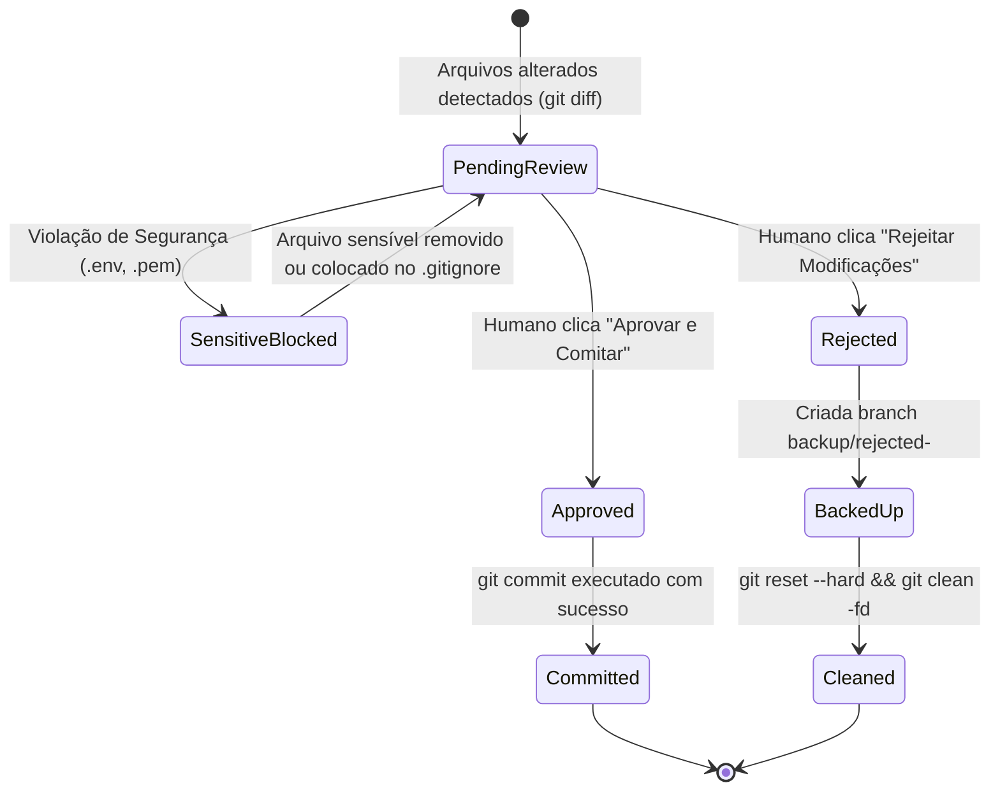

# Domain Entities - Unit 3: Git Supervisor & Commit Approval

## 1. Overview
Este documento especifica os modelos de domínio e entidades que governam o ciclo de supervisão de Git e aprovação humana de commits no Cockpit do Hivemind (AI-DLC).

---

## 2. Core Entities

### 2.1 `CommitApprovalRequest`
Representa uma solicitação de revisão de modificações pendentes no repositório enviada pelo supervisor aos operadores do Cockpit.

```typescript
export interface ChangedFileSummary {
  path: string;
  status: 'added' | 'modified' | 'deleted' | 'untracked';
  additions: number;
  deletions: number;
}

export interface CommitApprovalRequest {
  id: string; // UUID da solicitação
  projectId: string;
  taskId?: string;
  workingDir: string;
  rawDiff: string;
  filesChanged: ChangedFileSummary[];
  totalAdditions: number;
  totalDeletions: number;
  suggestedMessage: string; // Conventional Commits gerado pela IA
  sensitiveFilesDetected: string[]; // Lista de violações de segurança
  status: 'pending' | 'approved' | 'rejected';
  createdAt: string;
}
```

### 2.2 `CommitDecision`
Representa a ação deliberada do operador humano ao interagir com o modal de revisão.

```typescript
export interface CommitDecision {
  requestId?: string;
  projectId: string;
  action: 'approve' | 'reject';
  commitMessage?: string; // Obrigatório se action === 'approve'
  rejectionReason?: string; // Opcional se action === 'reject'
  operator: {
    id: string;
    name: string;
  };
  timestamp: string;
}
```

### 2.3 `CommitExecutionResult`
Representa o resultado consolidado da execução de commit no repositório.

```typescript
export interface CommitExecutionResult {
  success: boolean;
  action: 'committed' | 'rejected_and_backed_up';
  commitHash?: string;
  branch: string;
  backupBranch?: string; // Ex: 'backup/rejected-1727392800'
  filesCount: number;
  output: string;
  error?: string;
  timestamp: string;
}
```

### 2.4 `SensitiveFileRule` (Security Baseline)
Define os padrões de arquivos e tokens restritos que nunca podem ser incluídos em commits.

```typescript
export interface SensitiveFileRule {
  pattern: RegExp;
  category: 'env' | 'private_key' | 'credentials' | 'certificate';
  description: string;
  blocking: boolean;
}
```

---

## 3. Relationships & State Transitions


