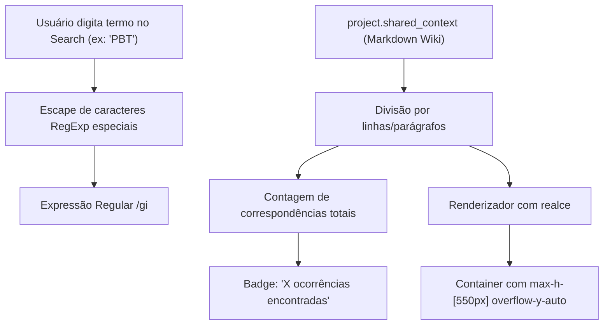

# Business Logic Model: Unit 3 - Wiki Técnica com Scroll Delimitado & Busca

## 1. Flow of Search & Highlighting

---

## 2. Text Highlighting Algorithm
Para evitar quebras no React e renderizar tags sem injeção perigosa de HTML:
1. Dado um parágrafo $P$ e termo de busca $T$:
2. Se $T$ estiver vazio, renderizar $P$ normalmente.
3. Se $T$ não estiver vazio:
   - Sanitizar caracteres especiais de regex: $T_{\text{safe}} = T.\text{replace}(/[.*+?^${}()|[\]\\]/g, '\\$&')$.
   - Dividir o parágrafo via `P.split(new RegExp(`(${T_{\text{safe}}})`, 'gi'))`.
   - Mapear cada pedaço: se coincidir com $T$ (case-insensitive), envelopar em `<mark className="bg-amber-400/30 text-amber-200 px-0.5 rounded font-semibold">{part}</mark>`, senão renderizar string pura.
4. Totalizar as ocorrências encontradas em todos os parágrafos para alimentar o badge de contagem.
