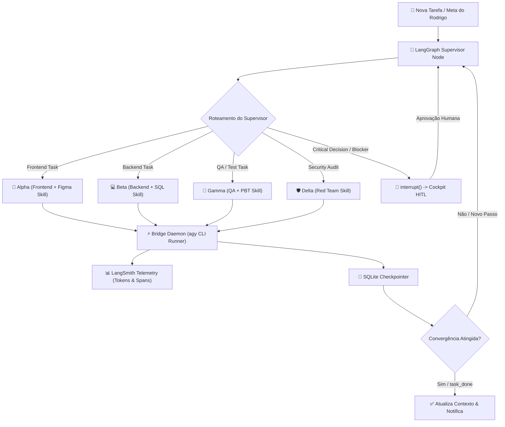

# Master Application Design: Hivemind Autonomous Multi-Agent Platform

## 1. Executive Summary & Architectural Overview
O Hivemind evolui para uma plataforma de orquestração multi-agente autônoma alimentada por **LangGraph.js**, observabilidade contínua via **LangSmith**, execução local de baixo custo através do **Antigravity CLI (`agy`)**, governança humana em tempo real com **Cockpit HITL** no Dashboard React, catálogo padronizado de **Skills Especializadas**, assistente de **Auto-Setup** (AI-DLC + MCP `codebase-memory`) e **Backup Resiliente em Nuvem S3**.

---

## 2. Core Components Inventory

1. **`COMP-01` LangGraph Orchestrator**: Máquina de estados distribuída (`StateGraph`), Supervisor router, detecção de convergência (`task_done`), interrupções humanas (`interrupt()`) e persistência transacional via SQLite Checkpointer.
2. **`COMP-02` Antigravity Bridge Daemon**: Executor orientado a eventos de instâncias locais do `agy` CLI com fila assíncrona, timeouts e circuit breaker.
3. **`COMP-03` LangSmith Telemetry Service**: Rastreamento end-to-end de traces, latências e custos de tokens por agente, integrando execuções do servidor e do CLI.
4. **`COMP-04` Project Setup & Onboarding Assistant**: CLI e UI para auto-configuração de repositórios com regras AI-DLC e MCP `codebase-memory`.
5. **`COMP-05` Cloud Resilience & S3 Backup**: Snapshots criptografados do banco e da memória arquitetural para Amazon S3.
6. **`COMP-06` Cockpit HITL (Frontend React 19)**: Controles de pausa/retomada de loop, resolução de blockers e cards de aprovação rápida.
7. **`COMP-07` Real-Time Multi-Agent Live Feed**: Interface Socket.IO de alta performance para visualização dos agentes colaborando.
8. **`COMP-08` Telemetry Dashboard**: Monitoramento gráfico de tokens, custos e métricas.
9. **`COMP-09` Modular Skills Catalog**: Pacote de 7 skills especializadas (`frontend-engineer`, `backend-engineer`, `ui-figma-reader`, `doc-researcher`, `qa-engineer`, `security-adversarial`, `infra-devops`).

---

## 3. Services & State Orchestration Pattern

---

## 4. Interfaces & Contract Specifications

- **`AgentGraphState`**: Estrutura de estado contendo `projectId`, `taskId`, `goal`, `messages`, `turnCount`, `maxTurns`, `status` e `pendingDecision`.
- **`IBridgeDaemon`**: Contrato para enfileirar e disparar execuções de CLI com `executeAgentCLI(req)` e publicar respostas no Hivemind.
- **`ITelemetryService`**: Instrumentação com `createTrace()`, `recordNodeSpan()` e `recordCLISpan()`.
- **`ISnapshotService`**: `createSnapshot()`, `exportToS3()` e `restoreFromS3()`.

---

## 5. Security, Resiliency & PBT Compliance

- **Security (SECURITY-01 a 06)**: Parametrização SQL absoluta no SQLite, sanitização de entrada em endpoints e isolamento de subprocessos sem vazamento de chaves de API.
- **Resiliency (RESILIENCY-01 a 15)**: RPO = 0 através de persistência síncrona antes do disparo, circuit breaker no Bridge Daemon e auditoria adversarial Red/Blue Team.
- **Property-Based Testing (PBT-01 a 09)**: Invariantes formais de round-trip para serialização de mensagens e snapshots S3, e invariantes de transição na máquina de estados do LangGraph.
