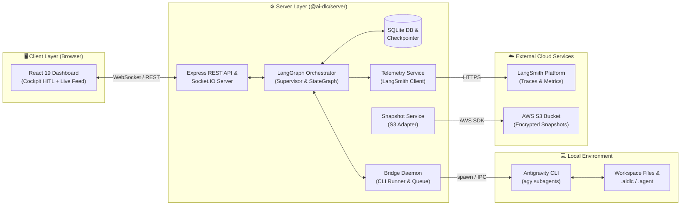

# Component Dependency & Communication Patterns: Hivemind Autonomous Ecosystem

## 1. Component Dependency Matrix

| Componente Origem | Componente Destino | Tipo de Dependência | Protocolo / Mecanismo |
|---|---|---|---|
| `LangGraphOrchestrator` | `SQLiteSaver / Database` | Persistência de Checkpoints | `better-sqlite3` (Síncrono/Transacional) |
| `LangGraphOrchestrator` | `BridgeDaemon` | Disparo de Agentes Especialistas | In-Process Event / IPC |
| `LangGraphOrchestrator` | `TelemetryService` | Traces & Spans de Nós | `langsmith` SDK (Async) |
| `BridgeDaemon` | `Antigravity CLI (agy)` | Execução de Agentes Locais | `child_process.spawn` (Subprocesso) |
| `BridgeDaemon` | `MessagesRouter / Express` | Publicação de Respostas | REST / In-Memory Service |
| `Cockpit HITL UI (web)` | `Server API (/interrupt/resume)` | Aprovação Humana de Decisões | HTTP POST / WebSocket |
| `TelemetryService` | `LangSmith Cloud` | Observabilidade & Tracing | HTTPS (TLS 1.3) |
| `CloudSnapshotService` | `AWS S3 API` | Upload/Download de Snapshots | AWS SDK v3 (`@aws-sdk/client-s3`) |
| `ProjectSetupService` | `CodebaseMemory MCP` | Indexação do Grafo de Código | MCP Protocol (JSON-RPC) |

---

## 2. Communication Architecture & Data Flow

---

## 3. Communication Patterns

1. **Assíncrono & Orientado a Eventos (Socket.IO + Fila)**:
   - Mensagens trocadas entre agentes e comandos do Supervisor são publicadas imediatamente na sala do projeto (`project_${projectId}`).
   - O Bridge Daemon consome eventos da fila com controle de concorrência.

2. **Pausa & Retomada Transacional (LangGraph Checkpoints)**:
   - Toda transição de nó é persistida no SQLite antes da execução do próximo passo.
   - Quando um `interrupt()` é acionado, o estado fica congelado em `waiting_human`. A requisição do cliente `/resume` reativa o grafo do ponto exato onde parou sem perda de contexto.

3. **Isolamento de Subprocessos com Sanitização**:
   - Cada chamada ao `agy` CLI é executada em um processo isolado, evitando que falhas de script ou loops travem o processo principal do servidor Node.js.
