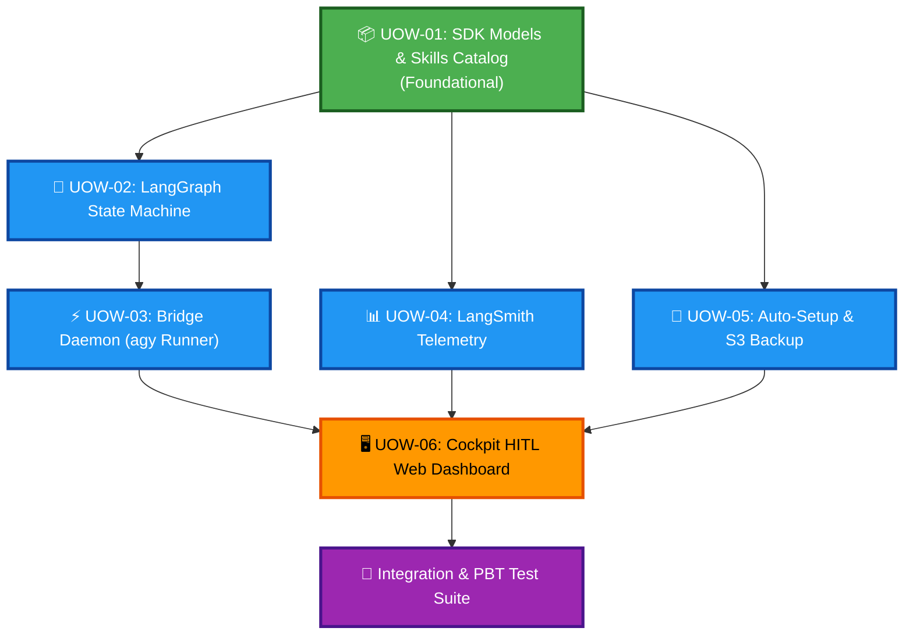

# Unit of Work Dependency Matrix & Execution Sequence

## 1. Unit Dependency Matrix

| Unidade | Nome | Depende De | Pode Executar em Paralelo Com |
|---|---|---|---|
| **`UOW-01`** | SDK Models & Skills Catalog | Nenhuma (Fundação) | — |
| **`UOW-02`** | LangGraph State Machine & Supervisor | `UOW-01` | `UOW-04`, `UOW-05` |
| **`UOW-03`** | Antigravity Bridge Daemon | `UOW-01`, `UOW-02` | `UOW-04`, `UOW-05` |
| **`UOW-04`** | LangSmith Observability & Telemetry | `UOW-01` | `UOW-02`, `UOW-03`, `UOW-05` |
| **`UOW-05`** | Project Auto-Setup & S3 Backup | `UOW-01` | `UOW-02`, `UOW-03`, `UOW-04` |
| **`UOW-06`** | Cockpit HITL Web Dashboard | `UOW-01`, `UOW-02`, `UOW-03`, `UOW-04` | — |

---

## 2. Construction Execution Sequence

