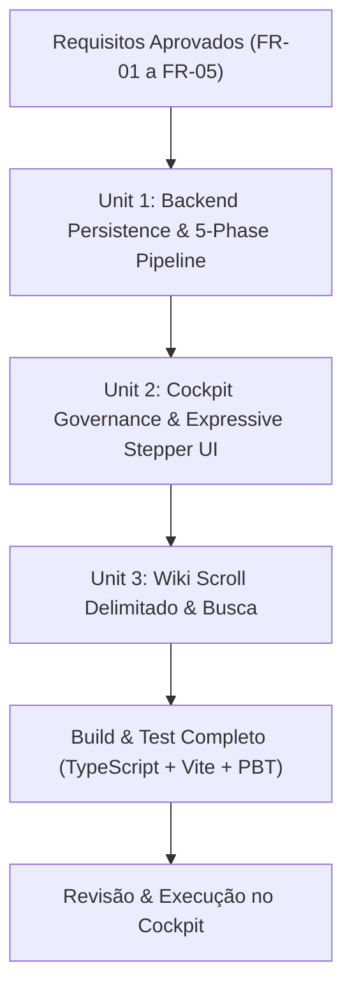

# Workflow Execution Plan: Cockpit Security UI, Status & Wiki Overhaul (Iteration 3)

## 1. Context & Scope
- **Project**: Hivemind AI-DLC (Monorepo `@ai-dlc/server`, `web`, `@ai-dlc/sdk`)
- **Iteration Focus**: Iteration 3 - Cockpit Security UI Overhaul, Real Database Persistence, 5-Phase Expressive Stepper, and Wiki Scroll & Search.
- **Risk Level**: Médio-Baixo (sem quebra de contratos de banco existentes; migração aditiva no SQLite e refatoração de componentes React).

---

## 2. Decomposition into Units of Work

### Unit 1: Backend Persistence & 5-Phase Security Pipeline
- **Package**: `packages/server`
- **Responsibilities**:
  - Auto-migration no SQLite: adicionar `security_score` (INTEGER), `security_rating` (TEXT), `last_security_audit_at` (DATETIME) na tabela `projects`.
  - Atualização de queries (`getProject`, `updateProjectSecurityScore`).
  - Atualização do endpoint `POST /api/projects/:projectId/security/scan` para emitir eventos `security_phase_progress` em 5 fases sequenciais via Socket.IO:
    1. Mapeamento de Rotas, CORS e Headers
    2. Varredura de Segredos e `.env`
    3. Simulação Adversarial OWASP (Delta Red Team)
    4. Elaboração de Mitigações (Beta Blue Team)
    5. Verificação & Persistência no SQLite
  - Testes Unitários e Property-Based Testing com `fast-check` (invariantes de score $0..100$ e transições de fase).

### Unit 2: Cockpit UI Overhaul (Remoção da Caixa de Texto, Painel de Governança & Status Expressivo)
- **Package**: `packages/web`
- **Responsibilities**:
  - `CockpitPanel.tsx`:
    - Remoção do input de texto `goalInput` ("Ex: Criar tela do Figma...").
    - Reformulação da seção para **"Governança & Operações de Segurança"**, mantendo seletores de modelo/raciocínio e botão de disparo de auditoria.
    - Implementação do **Stepper Visual de 5 Fases** acompanhado de **Mini-Ticker Dinâmico** na área marcada pelo usuário (substituindo o antigo texto estático).
    - Substituição do fallback `score ?? 100` pelo score real persistido `project.security_score` (ou `-- / 100` caso não auditado).
  - `SecurityAuditPanel.tsx`:
    - Atualização do Card 4 de estatísticas para **"Mitigações Verificadas"** exibindo porcentagem matemática real e contagem fracionária `(X/Y)`.

### Unit 3: Wiki Técnica com Scroll Delimitado & Busca em Tempo Real
- **Package**: `packages/web`
- **Responsibilities**:
  - `ProjectView.tsx`:
    - Inserção de campo de busca simples no topo da Wiki Técnica com ícone de busca e contador dinâmico de correspondências.
    - Delimitação da altura máxima em `max-h-[550px] overflow-y-auto` com scrollbar escura customizada.
    - Realce (*highlighting*) em tempo real dos termos buscados nos parágrafos da documentação técnica.

---

## 3. Workflow Stages Execution Strategy

### Stage Matrix
| Stage | Execution | Rationale |
|---|---|---|
| Inception: Requirements Analysis | Executed | Concluído com 5 requisitos funcionais e 3 NFRs aprovados |
| Inception: User Stories | Executed | US-9 a US-12 documentadas em Gherkin |
| Inception: Workflow Planning | Executed | Plano atual dividindo em 3 Units sequenciais |
| Construction: Functional Design | Per-Unit | Especificar interfaces e schemas por unidade |
| Construction: Code Generation | Per-Unit | Implementação incremental em código |
| Construction: Build and Test | Mandatory | Bateria de testes unitários, PBT e compilação TS/Vite |
| Operations | Skipped | Placeholder no ciclo AI-DLC |
