# Execution Plan: Autonomous Multi-Agent Hivemind Platform

## Detailed Analysis Summary

### Transformation Scope (Brownfield Monorepo)
- **Transformation Type**: System-wide Architectural Enhancement & Feature Addition
- **Primary Changes**:
  - Implement **LangGraph.js** state machine and Supervisor routing engine in `@ai-dlc/server`.
  - Implement **Bridge Daemon** for event-driven Antigravity CLI (`agy`) execution with circuit breakers.
  - Implement **LangSmith** tracing and token cost accounting for all agent and CLI activities.
  - Expand React Web Dashboard (`web`) with **Human-in-the-Loop Cockpit** and `interrupt()` approval cards.
  - Create standardized catalog of **Specialized Agent Skills** in `.agent/skills/`.
  - Add **Auto-Setup Assistant** for rapid project onboarding (AI-DLC + MCP `codebase-memory`).
  - Add **Cloud Resilience / S3 Snapshot** backup and restore engine.
- **Affected Packages**: `@ai-dlc/server`, `web`, `@ai-dlc/sdk`, `.agent/skills/`, and CLI bridge scripts.

### Change Impact Assessment
- **User-Facing Changes**: Sim. O painel web ganha controles de pausa/intervenção do loop, visualização ao vivo de grafos e cards de aprovação rápida.
- **Structural Changes**: Sim. O AI Manager evolui de chains simples para uma máquina de estados com grafos cíclicos (`StateGraph`) do LangGraph.
- **Data Model Changes**: Sim. Novos campos e tabelas no SQLite para checkpoints do LangGraph, traces de execução e histórico de snapshots.
- **API Changes**: Sim. Novos endpoints REST e eventos Socket.IO para controle do loop autônomo, aprovação de interrupções (`/interrupt/resume`) e backup S3.
- **NFR Impact**: Alto. Enforcing das extensões Security Baseline, Resiliency Baseline e Property-Based Testing (PBT).

### Component Relationships
- **Primary Service**: `@ai-dlc/server` (Express, Socket.IO, LangGraph, LangSmith, SQLite)
- **Client Application**: `web` (React 19, Vite, TailwindCSS, Cockpit HITL)
- **Client SDK**: `@ai-dlc/sdk` (AiDlcClient com novos métodos de streaming e status)
- **Autonomous Bridge**: `bridge-daemon` (Local `agy` CLI runner & subprocess manager)
- **Custom Skills**: `.agent/skills/*` (Personas de Frontend, Backend, QA, Red Team, Infra, Docs)

### Risk Assessment
- **Risk Level**: Medium-High (Orquestração assíncrona concorrente com múltiplos agentes e chamadas de CLI)
- **Rollback Complexity**: Moderate (Banco SQLite versionado com snapshots e arquitetura modular)
- **Testing Complexity**: Comprehensive (Exige testes baseados em propriedades PBT, testes de integração e validação adversarial Red/Blue Team)

---

## Workflow Visualization

```mermaid
flowchart TD
    Start(["User Request"])
    
    subgraph INCEPTION["🔵 INCEPTION PHASE"]
        WD["Workspace Detection<br/><b>COMPLETED</b>"]
        RE["Reverse Engineering<br/><b>COMPLETED</b>"]
        RA["Requirements Analysis<br/><b>COMPLETED</b>"]
        US["User Stories<br/><b>COMPLETED</b>"]
        WP["Workflow Planning<br/><b>COMPLETED</b>"]
        AD["Application Design<br/><b>EXECUTE</b>"]
        UG["Units Generation<br/><b>EXECUTE</b>"]
    end
    
    subgraph CONSTRUCTION["🟢 CONSTRUCTION PHASE"]
        FD["Functional Design<br/>(Per Unit)<br/><b>EXECUTE</b>"]
        NFRA["NFR Requirements<br/>(Per Unit)<br/><b>EXECUTE</b>"]
        NFRD["NFR Design<br/>(Per Unit)<br/><b>EXECUTE</b>"]
        ID["Infrastructure Design<br/>(Per Unit)<br/><b>EXECUTE</b>"]
        CG["Code Generation<br/>(Planning + Generation)<br/><b>EXECUTE</b>"]
        BT["Build and Test<br/><b>EXECUTE</b>"]
    end
    
    subgraph OPERATIONS["🟡 OPERATIONS PHASE"]
        OPS["Operations<br/><b>PLACEHOLDER</b>"]
    end
    
    Start --> WD
    WD --> RE
    RE --> RA
    RA --> US
    US --> WP
    WP --> AD
    AD --> UG
    UG --> FD
    FD --> NFRA
    NFRA --> NFRD
    NFRD --> ID
    ID --> CG
    CG -.->|Next Unit Loop| FD
    CG --> BT
    BT -.-> OPS
    BT --> End(["Complete"])

    style WD fill:#4CAF50,stroke:#1B5E20,stroke-width:3px,color:#fff
    style RE fill:#4CAF50,stroke:#1B5E20,stroke-width:3px,color:#fff
    style RA fill:#4CAF50,stroke:#1B5E20,stroke-width:3px,color:#fff
    style US fill:#4CAF50,stroke:#1B5E20,stroke-width:3px,color:#fff
    style WP fill:#4CAF50,stroke:#1B5E20,stroke-width:3px,color:#fff
    style AD fill:#FFA726,stroke:#E65100,stroke-width:3px,stroke-dasharray: 5 5,color:#000
    style UG fill:#FFA726,stroke:#E65100,stroke-width:3px,stroke-dasharray: 5 5,color:#000
    style FD fill:#FFA726,stroke:#E65100,stroke-width:3px,stroke-dasharray: 5 5,color:#000
    style NFRA fill:#FFA726,stroke:#E65100,stroke-width:3px,stroke-dasharray: 5 5,color:#000
    style NFRD fill:#FFA726,stroke:#E65100,stroke-width:3px,stroke-dasharray: 5 5,color:#000
    style ID fill:#FFA726,stroke:#E65100,stroke-width:3px,stroke-dasharray: 5 5,color:#000
    style CG fill:#4CAF50,stroke:#1B5E20,stroke-width:3px,color:#fff
    style BT fill:#4CAF50,stroke:#1B5E20,stroke-width:3px,color:#fff
    style OPS fill:#BDBDBD,stroke:#424242,stroke-width:2px,stroke-dasharray: 5 5,color:#000
    style Start fill:#CE93D8,stroke:#6A1B9A,stroke-width:3px,color:#000
    style End fill:#CE93D8,stroke:#6A1B9A,stroke-width:3px,color:#000

    style INCEPTION fill:#BBDEFB,stroke:#1565C0,stroke-width:3px,color:#000
    style CONSTRUCTION fill:#C8E6C9,stroke:#2E7D32,stroke-width:3px,color:#000
    style OPERATIONS fill:#FFF59D,stroke:#F57F17,stroke-width:3px,color:#000

    linkStyle default stroke:#333,stroke-width:2px
```

### Text Alternative for Workflow
1. **INCEPTION PHASE**:
   - Workspace Detection (COMPLETED)
   - Reverse Engineering (COMPLETED)
   - Requirements Analysis (COMPLETED)
   - User Stories (COMPLETED)
   - Workflow Planning (COMPLETED)
   - Application Design (EXECUTE — Modelagem dos nós LangGraph, schemas de checkpoint e bridge)
   - Units Generation (EXECUTE — Decomposição em 6 unidades independentes de trabalho)
2. **CONSTRUCTION PHASE** (Executado por unidade):
   - Functional Design (EXECUTE)
   - NFR Requirements (EXECUTE)
   - NFR Design (EXECUTE)
   - Infrastructure Design (EXECUTE)
   - Code Generation (EXECUTE — Part 1 Planning + Part 2 Generation)
   - Build and Test (EXECUTE — Validação PBT e integração)
3. **OPERATIONS PHASE**:
   - Operations (PLACEHOLDER)

---

## Phases to Execute & Rationale

### 🔵 INCEPTION PHASE
- [x] **Workspace Detection** (COMPLETED)
- [x] **Reverse Engineering** (COMPLETED)
- [x] **Requirements Analysis** (COMPLETED)
- [x] **User Stories** (COMPLETED)
- [x] **Workflow Planning** (COMPLETED)
- [ ] **Application Design** (EXECUTE)
  - *Rationale*: A integração de LangGraph, LangSmith, Bridge Daemon e novos contratos de API requer uma modelagem de arquitetura formal de componentes e fluxos de estado.
- [ ] **Units Generation** (EXECUTE)
  - *Rationale*: O sistema possui escopo amplo e deve ser decomposto em 6 unidades modulares de desenvolvimento.

### 🟢 CONSTRUCTION PHASE (Per-Unit Execution)
- [ ] **Functional Design** (EXECUTE)
  - *Rationale*: Definir detalhadamente a lógica de transição de estados do LangGraph, payloads do daemon e schemas de snapshot.
- [ ] **NFR Requirements** (EXECUTE)
  - *Rationale*: Implementar requisitos das 3 extensões ativadas (Security, Resiliency, PBT).
- [ ] **NFR Design** (EXECUTE)
  - *Rationale*: Incorporar circuit breakers, checkpointer seguro e geradores PBT.
- [ ] **Infrastructure Design** (EXECUTE)
  - *Rationale*: Definir comunicação de processos locais (`agy`), variáveis do LangSmith e configuração S3.
- [ ] **Code Generation** (EXECUTE - ALWAYS)
  - *Rationale*: Planejamento passo a passo e geração de código em TypeScript/React.
- [ ] **Build and Test** (EXECUTE - ALWAYS)
  - *Rationale*: Execução da suíte de testes unitários, integração e PBT.

---

## Package Update Sequence

1. **`@ai-dlc/sdk`**: Atualizar tipos de dados (`Message`, `AgentState`, `InterruptPayload`) e métodos de cliente.
2. **`.agent/skills/`**: Gerar o catálogo completo de skills especializadas para os agentes.
3. **`@ai-dlc/server`**:
   - Instalar `@langchain/langgraph` e `langsmith`.
   - Implementar a máquina de estados do LangGraph, Supervisor node e checkpointers.
   - Implementar o `bridge-daemon` para disparo seguro de instâncias `agy`.
   - Adicionar endpoints de interrupção/retomada, auto-setup e backup S3.
4. **`web`**:
   - Criar Cockpit HITL no Dashboard com controles de pausa, intervenção e cards de aprovação de `interrupt()`.
   - Atualizar feed em tempo real e visualizador de telemetria LangSmith.
5. **Suíte de Testes & Verificação**:
   - Implementar suíte de testes com PBT (fast-check) e simulações completas de diálogo autônomo.

---

## Success Criteria & Quality Gates

- ✅ **Convergência Autônoma**: Múltiplos agentes conversam e resolvem tarefas sem loop infinito.
- ✅ **Governança Humana**: Toda decisão crítica aciona `interrupt()` e aguarda 1 clique no Dashboard.
- ✅ **Observabilidade LangSmith**: 100% das execuções possuem traces com métricas de tokens e latência.
- ✅ **Segurança e Resiliência**: Zero blocking security findings e RPO = 0 garantido no SQLite.
- ✅ **Testes PBT**: 100% dos testes de invariantes e round-trip aprovados.
