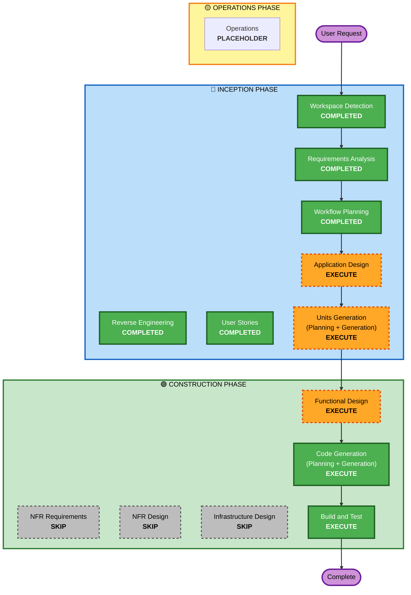

# Execution Plan

## Detailed Analysis Summary

### Transformation Scope (Brownfield Only)
- **Transformation Type**: System Enhancement & Refactoring
- **Primary Changes**: Real-time streaming UI, LLM Auto-recovery, LLM Structured Output, Token Sliding Window, Desacoplamento de Prompts, e Supervisor Git Auto-Commit.
- **Related Components**: `server` (`ai-manager.ts`, `nodes.ts`, `bridge-daemon.ts`), `web` (Cockpit UI).

### Change Impact Assessment
- **User-facing changes**: Yes - Cockpit vai exibir estados granulares (Thinking/Typing) via streaming, notificações de timeout/recovery e painel de Diff do Git.
- **Structural changes**: Yes - O fluxo de eventos Socket.IO vai passar de síncrono por turno para eventos streamados.
- **Data model changes**: No - O schema SQLite existente de mensagens e sessões suporta as mudanças (apenas estados locais na memória/UI precisam mudar).
- **API changes**: Yes - A comunicação com a API do Google GenAI muda para suportar `responseSchema` e a emissão de Socket.IO será baseada em chunks.
- **NFR impact**: Yes - Prevenção de injeção de prompt e JSON quebrado (Security), otimização de uso de tokens (Performance) e resiliência assíncrona (Process).

### Component Relationships (Brownfield Only)
## Component Relationships
- **Primary Component**: `server` (backend Node.js/LangGraph engine)
- **Dependent Components**: `web` (React Cockpit interface que consome os websockets)
- **Shared Components**: `@ai-dlc/sdk` (tipos de payload e interrupt que serão estendidos para Auto-Commit / Retry).

### Risk Assessment
- **Risk Level**: High (Modificação no núcleo de comunicação entre Engine AI e UI)
- **Rollback Complexity**: Moderate (Pode ser revertido via git, mas altera comportamento esperado)
- **Testing Complexity**: Complex (Testes exigem simular delays de rede, rate limits falsos (429) e injeção maliciosa de prompt).

## Workflow Visualization

```mermaid
flowchart TD
    Start(["User Request"])
    
    subgraph INCEPTION["🔵 INCEPTION PHASE"]
        WD["Workspace Detection<br/><b>COMPLETED</b>"]
        RE["Reverse Engineering<br/><b>COMPLETED</b>"]
        RA["Requirements Analysis<br/><b>COMPLETED</b>"]
        US["User Stories<br/><b>COMPLETED</b>"]
        WP["Workflow Planning<br/><b>COMPLETED</b>"]
        AD["Application Design<br/><b>EXECUTE</b>"]
        UG["Units Generation<br/>(Planning + Generation)<br/><b>EXECUTE</b>"]
    end
    
    subgraph CONSTRUCTION["🟢 CONSTRUCTION PHASE"]
        FD["Functional Design<br/><b>EXECUTE</b>"]
        NFRA["NFR Requirements<br/><b>SKIP</b>"]
        NFRD["NFR Design<br/><b>SKIP</b>"]
        ID["Infrastructure Design<br/><b>SKIP</b>"]
        CG["Code Generation<br/>(Planning + Generation)<br/><b>EXECUTE</b>"]
        BT["Build and Test<br/><b>EXECUTE</b>"]
    end
    
    subgraph OPERATIONS["🟡 OPERATIONS PHASE"]
        OPS["Operations<br/><b>PLACEHOLDER</b>"]
    end
    
    Start --> WD
    WD --> RA
    RA --> WP
    WP --> AD
    AD --> UG
    UG --> FD
    FD --> CG
    CG --> BT
    BT --> End(["Complete"])
    
    style WD fill:#4CAF50,stroke:#1B5E20,stroke-width:3px,color:#fff
    style RE fill:#4CAF50,stroke:#1B5E20,stroke-width:3px,color:#fff
    style RA fill:#4CAF50,stroke:#1B5E20,stroke-width:3px,color:#fff
    style US fill:#4CAF50,stroke:#1B5E20,stroke-width:3px,color:#fff
    style WP fill:#4CAF50,stroke:#1B5E20,stroke-width:3px,color:#fff
    
    style AD fill:#FFA726,stroke:#E65100,stroke-width:3px,stroke-dasharray: 5 5,color:#000
    style UG fill:#FFA726,stroke:#E65100,stroke-width:3px,stroke-dasharray: 5 5,color:#000
    style FD fill:#FFA726,stroke:#E65100,stroke-width:3px,stroke-dasharray: 5 5,color:#000
    
    style CG fill:#4CAF50,stroke:#1B5E20,stroke-width:3px,color:#fff
    style BT fill:#4CAF50,stroke:#1B5E20,stroke-width:3px,color:#fff
    
    style NFRA fill:#BDBDBD,stroke:#424242,stroke-width:2px,stroke-dasharray: 5 5,color:#000
    style NFRD fill:#BDBDBD,stroke:#424242,stroke-width:2px,stroke-dasharray: 5 5,color:#000
    style ID fill:#BDBDBD,stroke:#424242,stroke-width:2px,stroke-dasharray: 5 5,color:#000
    
    style INCEPTION fill:#BBDEFB,stroke:#1565C0,stroke-width:3px, color:#000
    style CONSTRUCTION fill:#C8E6C9,stroke:#2E7D32,stroke-width:3px, color:#000
    style OPERATIONS fill:#FFF59D,stroke:#F57F17,stroke-width:3px, color:#000
    style Start fill:#CE93D8,stroke:#6A1B9A,stroke-width:3px,color:#000
    style End fill:#CE93D8,stroke:#6A1B9A,stroke-width:3px,color:#000
    
    linkStyle default stroke:#333,stroke-width:2px
```

## Phases to Execute

### 🔵 INCEPTION PHASE
- [x] Workspace Detection (COMPLETED)
- [x] Reverse Engineering (COMPLETED)
- [x] Requirements Analysis (COMPLETED)
- [x] User Stories (COMPLETED)
- [x] Execution Plan (IN PROGRESS)
- [ ] Application Design - EXECUTE
  - **Rationale**: Precisamos mapear os novos payloads de Socket.IO para o Streaming, os novos métodos no AI-Manager para Structured Outputs e o protocolo de Commit-Diff.
- [ ] Units Generation - EXECUTE
  - **Rationale**: Quebrar o escopo em unidades gerenciáveis para o backend, UI e Integração.

### 🟢 CONSTRUCTION PHASE
- [ ] Functional Design - EXECUTE
  - **Rationale**: Desenhar os algoritmos específicos da "sliding window", o Retry Backoff e o streaming generator para o modelo local.
- [ ] NFR Requirements - SKIP
  - **Rationale**: Já englobados na análise de requisitos inicial (Segurança, Performance, Resiliência).
- [ ] NFR Design - SKIP
  - **Rationale**: Será integrado no Functional Design (não necessita passo em separado).
- [ ] Infrastructure Design - SKIP
  - **Rationale**: A topologia não muda (mesmo servidor, mesma porta, mesmo DB SQLite e WebSocket).
- [ ] Code Generation - EXECUTE (ALWAYS)
  - **Rationale**: Implementation planning and code generation needed
- [ ] Build and Test - EXECUTE (ALWAYS)
  - **Rationale**: Build, test, and verification needed. A validação Red/Blue adversarial e Testes de Propriedade será ativada!

### 🟡 OPERATIONS PHASE
- [ ] Operations - PLACEHOLDER
  - **Rationale**: Future deployment and monitoring workflows

## Estimated Timeline
- **Total Phases**: 6 (AD, UG, FD, CG, BT)
- **Estimated Duration**: 2-3 sessões interativas.

## Success Criteria
- **Primary Goal**: Sistema tolerante a falhas do provedor LLM, 100% livre de JSON manual e UI hiper-reativa.
- **Key Deliverables**: Códigos refatorados, testes PBT (Property-based) passando, Streaming real funcionando.
- **Quality Gates**: Passar pela bateria de testes PBT (Property-Based Testing) focados na resiliência e validação Security (Red Team) testando prompt injections nos novos métodos.
