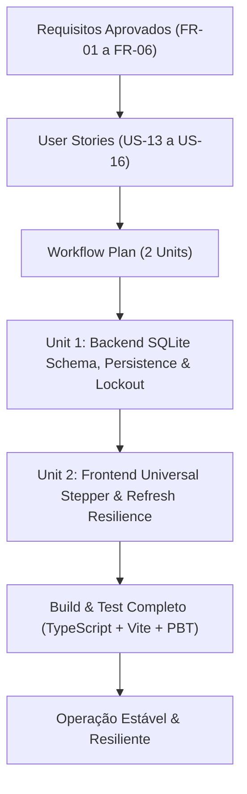

# Workflow Execution Plan: Iteration 4 - Persistent Security Run State & Universal Stepper

## 1. Context & Scope
- **Project**: Hivemind AI-DLC (Monorepo `@ai-dlc/server`, `web`)
- **Iteration Focus**: Iteração 4 - Persistência do Estado do Pipeline no SQLite (`security_runs`), Resiliência completa a Page Refresh (F5), Bloqueio de Concorrência/Idempotência por Banco, e Stepper Universal no `SecurityAuditPanel`.
- **Risk Level**: Baixo-Médio (extensão aditiva de esquema no SQLite com nova tabela `security_runs`, sem impacto destrutivo em dados existentes).

---

## 2. Decomposition into Units of Work

### Unit 1: Backend SQLite Schema (`security_runs`), Service Persistence & Lockout
- **Package**: `packages/server`
- **Responsibilities**:
  - Schema & Auto-migration: criação da tabela `security_runs` (`id`, `project_id`, `phase`, `total_phases`, `phase_name`, `status`, `agent_role`, `agent_name`, `current_check`, `target_file`, `findings_count`, `score`, `started_at`, `updated_at`, `completed_at`) em `schema.sql` e `connection.ts`.
  - Queries: implementação de `createSecurityRun`, `updateSecurityRunProgress`, `getLatestSecurityRun` e `getActiveSecurityRun` em `queries.ts`.
  - Service: evolução do `SecurityPipelineService`:
    - Geração de `run_id` determinístico (`run_sec_<timestamp>_<random>`).
    - Gravação síncrona/atômica de cada fase ($1 \rightarrow 2 \rightarrow 3 \rightarrow 4 \rightarrow 5$) no SQLite antes da emissão via Socket.IO.
    - Gravação de conclusão na Fase 5 com persistência no projeto.
  - Endpoints:
    - `GET /api/projects/:projectId/security/run-status`: consulta do run mais recente do projeto.
    - `POST /api/projects/:projectId/security/scan`: verificação de run ativo no banco e retorno estrito de `HTTP 409 Conflict` se já houver scan em andamento.
  - Testes:
    - Testes unitários de persistência e ciclo de vida de runs.
    - Testes baseados em propriedades (PBT) com `fast-check` (invariantes de máquina de estados, unicidade de run ativo e integridade de transição de fases).

### Unit 2: Frontend Universal Stepper, Re-hidratação Pós-Refresh & Lockout Visual
- **Package**: `packages/web`
- **Responsibilities**:
  - `SecurityAuditPanel.tsx`:
    - Incorporação do Stepper visual de 5 fases e mini-ticker dinâmico diretamente na aba de Auditoria.
    - Consulta a `GET /api/projects/:projectId/security/run-status` na carga inicial (`useEffect`) para re-hidratar o estado do pipeline do SQLite.
    - Conexão e escuta contínua de eventos `security_phase_progress` via Socket.IO quando `status === 'running'`.
    - Bloqueio e feedback visual do botão de scan enquanto houver auditoria em andamento.
  - `CockpitPanel.tsx`:
    - Re-hidratação inicial a partir de `run-status` para manter coerência do Stepper ao transitar entre abas.
  - Compilação & Verificação: `npm run build -w web` sem erros de tipagem.

---

## 3. Workflow Stages Execution Strategy

### Stage Matrix
| Stage | Execution | Rationale |
|---|---|---|
| Inception: Requirements Analysis | Executed | Concluído com 6 requisitos funcionais e 3 NFRs aprovados |
| Inception: User Stories | Executed | US-13 a US-16 documentadas em Gherkin |
| Inception: Workflow Planning | Executed | Plano atual dividindo em 2 Units sequenciais |
| Construction: Functional Design | Per-Unit | Especificar interfaces, schemas e payloads por unidade |
| Construction: Code Generation | Per-Unit | Implementação incremental em código e testes |
| Construction: Build and Test | Mandatory | Bateria completa de testes unitários, PBTs e compilação TS/Vite |
| Operations | Skipped | Placeholder no ciclo AI-DLC |
