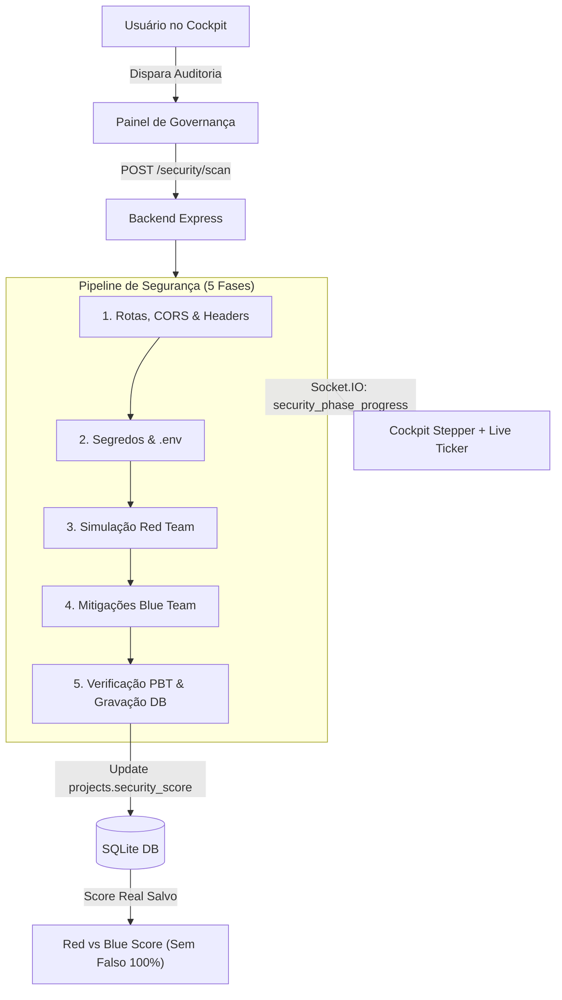

# Cockpit Security UI, Status & Wiki Overhaul - Requirements Document

## 1. Context & Business Intent
Na Iteração 3 do Hivemind AI-DLC, o objetivo é transformar a interface do Cockpit em uma ferramenta de governança de segurança executiva e de alta visibilidade, eliminando estados inconsistentes (o falso "100%" inicial), removendo elementos redundantes (caixa de texto que duplica a função do Terminal do Projeto), transformando o status de execução dos agentes em um pipeline expressivo de 5 fases com ticker dinâmico de segurança, e aprimorando a navegação da Wiki Técnica com scroll controlado e busca textual.

---

## 2. Functional Requirements (FR)

### FR-01: Persistência Real do Security Score no SQLite (Eliminação do Flash "100%")
- O schema da tabela `projects` deve incluir:
  - `security_score` (INTEGER, nullable)
  - `security_rating` (TEXT, nullable, ex: 'A+', 'A', 'B', 'C', 'F')
  - `last_security_audit_at` (DATETIME, nullable)
- Ao executar `GET /api/projects/:id`, esses campos devem ser retornados diretamente no payload do projeto.
- Ao rodar um scan de segurança via `POST /api/projects/:id/security/scan`, o score consolidado e a classificação calculada devem ser persistidos na tabela `projects`.
- O frontend (`CockpitPanel` e `SecurityAuditPanel`) deve eliminar o fallback `?? 100`. Caso o projeto não possua auditoria prévia gravada, deve exibir `-- / 100` e badge neutro com estado "Não Auditado".

### FR-02: Remoção do Input de Texto & Reformulação para Painel de Governança
- Remover o campo de input de texto `goalInput` do card "Coordenação Multi-Agente" no `CockpitPanel.tsx`.
- Centralizar qualquer entrada de texto conversacional / instruções livres exclusivamente na tela [Terminal do Projeto](file:///e:/code/hivemind/packages/web/src/pages/MessagesView.tsx) (`/projects/:id/messages`).
- O card superior é renomeado/reformulado para **"Governança & Operações de Segurança"**, preservando:
  - Seletor de Modelo de IA (Auto, Flex, 3.5 Flash, 3.7 Flash, 3.1 Pro)
  - Seletor de Raciocínio (Off, Low, Medium, High)
  - Seletor de Turnos / Profundidade
  - Botão de Ação Direta: "Disparar Auditoria Adversarial" (com estado animado de auditoria em progresso).

### FR-03: Pipeline Expressivo de 5 Fases de Segurança & Ticker Ativo
- Substituir a indicação genérica `● Executando (agente)...` por um **Pipeline Determinístico de 5 Fases**:
  - **Fase 1**: Mapeamento de Rotas, CORS e Headers HTTP
  - **Fase 2**: Varredura Estrita de Segredos e Credenciais (.env)
  - **Fase 3**: Simulação de Vetores Adversariais OWASP (Delta Red Team)
  - **Fase 4**: Elaboração e Validação de Mitigações (Beta Blue Team)
  - **Fase 5**: Verificação Formal PBT e Persistência no Banco
- O backend emitirá via Socket.IO eventos `security_phase_progress`:
  ```json
  {
    "projectId": "...",
    "phase": 3,
    "totalPhases": 5,
    "phaseName": "Simulação de Vetores Adversariais OWASP",
    "agent": "Delta Security (Red Team)",
    "currentCheck": "Auditando injeção NoSQL e sanitização em routes/*.ts",
    "timestamp": "2026-09-29T19:20:00Z"
  }
  ```
- O frontend exibirá uma barra visual com os 5 passos (`Fase X de 5`) + mini-ticker dinâmico informando a checagem em andamento.

### FR-04: Correção Semântica do Card 4 de Verificadas
- No `SecurityAuditPanel.tsx`, alterar o quarto card de estatísticas:
  - Título: **"Mitigações Verificadas"**
  - Valor: Cálculo percentual real: `Math.round((verified / (mitigated + verified || 1)) * 100)%` acompanhado da contagem `(verified/total_mitigadas)` (ex: `33% (1/3)` ou `0% (0/2)`).

### FR-05: Visão Geral & Wiki Técnica com Scroll Delimitado e Busca
- No `ProjectView.tsx` (aba `Visão Geral & Wiki Técnica`):
  - Inserir um campo de busca simples no cabeçalho do card:
    - Input de texto com ícone de lupa e botão de limpar busca (`x`).
    - Contador de ocorrências: `N correspondências encontradas`.
  - Delimitar o corpo do markdown em um container com altura máxima (`max-h-[550px] overflow-y-auto`) com estilo moderno de scrollbar.
  - Aplicar realce visual (*highlighting* `<mark>` com fundo amarelo/âmbar translúcido) em todas as palavras que coincidam com o termo buscado.

---

## 3. Non-Functional Requirements (NFR)

### NFR-01: Security Baseline (Enforced)
- A persistência no SQLite deve utilizar prepared statements estritos (`db.prepare()`) sem concatenação de SQL.
- O campo de busca da Wiki Técnica no frontend deve sanitizar regex e evitar injection de caracteres especiais que possam causar crash no runtime do React.

### NFR-02: Resiliency Baseline (Enforced)
- Caso ocorra desconexão de rede ou falha no WebSocket durante uma auditoria, o frontend deve reter a última fase concluída e restabelecer o estado via polling fallback (`GET /api/projects/:id/security`).
- Estados de erro durante o scan devem atualizar a fase para `Fase com Alerta` sem congelar a interface.

### NFR-03: Property-Based Testing (PBT-01 a PBT-09)
- Validar via `fast-check`:
  - Invariante de Score e Rating: para qualquer conjunto de severidades e deduções, $0 \le \text{score} \le 100$ e o rating corresponde estritamente às faixas de pontuação.
  - Invariante de Cálculo Percentual de Verificação: para quaisquer números inteiros de mitigações e verificações, a porcentagem resultante é sempre finita, limitada entre 0 e 100%, sem divisão por zero (`NaN`).
  - Invariante de Destaque da Busca: o texto original renderizado com tags de highlight preserva a totalidade dos caracteres originais quando as tags são removidas.

---

## 4. Visual Workflow Diagram


