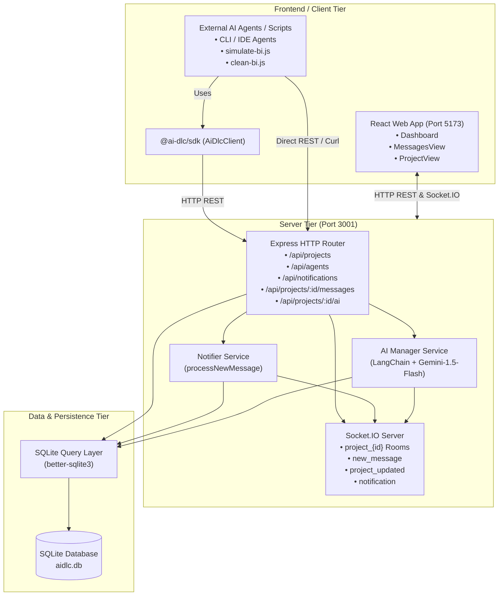
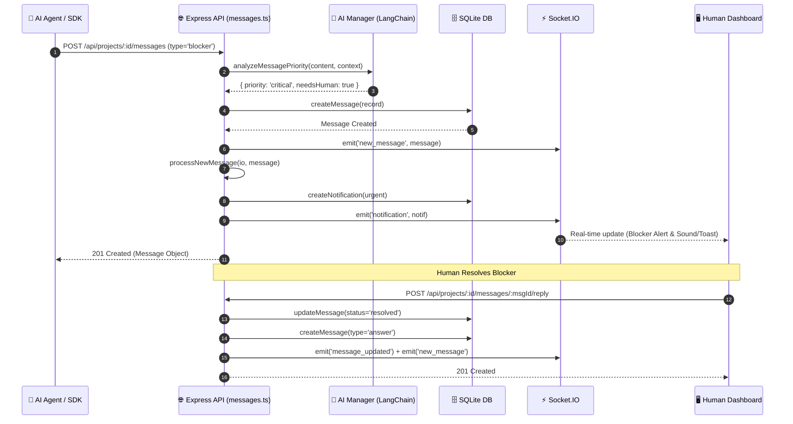

# System Architecture

## System Overview

Hivemind is structured as a TypeScript/Node.js npm monorepo with three core workspaces:
1. **`@ai-dlc/server`**: Express REST API + Socket.IO server + SQLite DB + LangChain/Gemini integration.
2. **`web`**: React 19 + Vite + TailwindCSS dashboard application.
3. **`@ai-dlc/sdk`**: Minimal TypeScript client library for external agent tooling.

---

## Architecture Diagram

### Text Alternative for Architecture
- **Client Tier**: React web application communicating via HTTP and WebSockets; external AI agents communicating via `@ai-dlc/sdk` or REST endpoints.
- **Server Tier**: Express application routing requests to database query handlers, Socket.IO real-time broadcaster, Notifier service, and LangChain/Gemini AI Manager.
- **Data Tier**: SQLite database (`aidlc.db`) managed via `better-sqlite3` executing synchronous relational queries.

---

## Component Descriptions

### 1. `packages/server`
- **Purpose**: Backend REST and WebSocket service.
- **Responsibilities**:
  - Exposes REST endpoints (`/api/projects`, `/api/agents`, `/api/notifications`, `/api/projects/:projectId/messages`, `/api/projects/:projectId/ai`).
  - Manages Socket.IO rooms (`project_${projectId}`) for scoped message broadcasting.
  - Interacts with Google Generative AI via `@langchain/google-genai` for context expansion, message classification, and project summarization.
- **Dependencies**: `express`, `socket.io`, `cors`, `dotenv`, `better-sqlite3`, `langchain`, `@langchain/google-genai`.
- **Type**: Application Backend.

### 2. `packages/web`
- **Purpose**: Interactive Dashboard and real-time monitoring interface.
- **Responsibilities**:
  - Live chat view with thread tracking, priority badges, and markdown rendering.
  - Interactive blocker resolution workflow.
  - Project creation, status overview, and notification badge indicators.
- **Dependencies**: `react`, `react-dom`, `react-router-dom`, `socket.io-client`, `lucide-react`, `tailwindcss`, `vite`.
- **Type**: Application Frontend.

### 3. `packages/sdk`
- **Purpose**: Client SDK for AI agent integration.
- **Responsibilities**:
  - Simple typed interface (`AiDlcClient`) providing methods: `post`, `read`, `pending`.
  - Automatic `X-Agent-Key` header injection.
- **Dependencies**: Native `fetch` (standard ES module).
- **Type**: Shared Client Library.

---

## Data Flow: Message Submission & Real-Time Escalation

---

## Integration Points

- **External APIs**:
  - **Google Gemini API** (`gemini-1.5-flash` via `@langchain/google-genai`) for LLM summarization, context generation, and message priority assessment.
- **Database**:
  - SQLite database accessed locally via `better-sqlite3`.
- **Real-Time WebSockets**:
  - Socket.IO server running on port 3001.

---

## Infrastructure & Runtime Components

- **Runtime**: Node.js (v18+) runtime environment.
- **Monorepo Management**: npm workspaces (`npm run dev`, `npm run build`).
- **Configuration**: Environment variables configured in `.env` (`PORT`, `GOOGLE_API_KEY`, `VITE_API_URL`).
