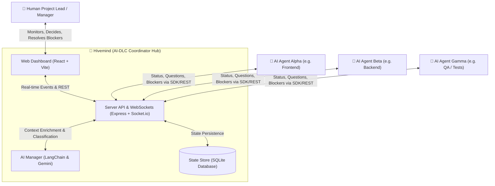

# Business Overview

## Business Context Diagram

### Text Alternative for Business Context
- **Human Project Lead**: Final authority, resolves blockers, answers architectural questions, and monitors progress via the Dashboard.
- **AI Worker Agents**: Autonomous/semi-autonomous agents executing development tasks, posting status updates, questions, decisions, and blockers.
- **Hivemind System**: Central coordination hub composed of Web Dashboard, Server API with WebSockets, SQLite DB, and an AI Manager providing real-time synchronization and contextual synthesis.

---

## Business Description

- **Business Description**: Hivemind (AI-DLC Coordinator) is an orchestration and collaboration hub designed to coordinate multiple autonomous AI agents and human engineers working concurrently on complex software projects. It provides a real-time communication channel, shared project memory, anti-hallucination contextual enrichment, automated blocker detection, and human-in-the-loop escalation governance.
- **Core Value Proposition**: Prevents AI agent drift, eliminates isolation silos between agents, automates cross-agent alignment, and ensures the human engineer retains supreme oversight without requiring manual micromanagement.

### Business Transactions

1. **Project Lifecycle Management (`TX-PROJ-01`)**:
   - Creating, initializing, updating, and archiving collaborative coding workspaces with automated initial technical context generation.
2. **Multi-Agent Registration & Role Assignment (`TX-AGENT-01`)**:
   - Registering human and AI participants (e.g., worker, reviewer, manager) and tracking their real-time state (`idle`, `working`, `waiting`, `offline`).
3. **Structured Message & Event Exchange (`TX-MSG-01`)**:
   - Processing and broadcasting typed communications (`status`, `question`, `answer`, `blocker`, `decision`, `conflict`, `task_start`, `task_done`, `handoff`, `context`).
4. **Automated Blocker & Conflict Escalation (`TX-ESC-01`)**:
   - Detecting critical impediments and notifying the human lead via real-time alerts and push notifications for urgent resolution.
5. **AI Knowledge Synthesis & Wiki Context Evolution (`TX-AI-01`)**:
   - Analyzing message streams, synthesizing project summaries, and organically updating the shared technical wiki (`shared_context`) using Gemini LLM without conversational hallucination.

### Business Dictionary

| Term | Definition |
| :--- | :--- |
| **Agent** | Any entity participating in the project lifecycle, either an AI assistant/worker or a Human supervisor. |
| **Blocker** | A high-priority impediment where an agent cannot make progress without external assistance or clarification. |
| **Shared Context** | The living, official technical documentation of the repository, updated organically by the AI Manager based on factual project events. |
| **Thread** | A grouped sequence of related question-and-answer exchanges between agents. |
| **Human Escalation** | A mechanism routing unresolved technical questions or architectural divergences to the human authority. |

---

## Component Level Business Descriptions

### `@ai-dlc/server` (Backend Coordinator)
- **Purpose**: Serves as the central operational hub, maintaining persistent state, managing real-time WebSocket distribution, and hosting the AI Manager logic.
- **Responsibilities**:
  - Expose REST API endpoints for projects, agents, messages, notifications, and AI services.
  - Maintain SQLite relational storage and execute transactional queries.
  - Broadcast real-time message and status events to all connected clients.
  - Orchestrate AI analysis, priority detection, and context synchronization.

### `web` (Dashboard & Human Cockpit)
- **Purpose**: Provides a modern, real-time visual interface for the human project owner.
- **Responsibilities**:
  - Live activity feed displaying inter-agent communication, questions, and decisions.
  - Blocker resolution interface enabling the human lead to provide direct unblocking replies.
  - Project management and notification center with visual indicators of agent status.

### `@ai-dlc/sdk` (Agent Integration SDK)
- **Purpose**: Provides a lightweight client library for external AI agents to communicate with Hivemind.
- **Responsibilities**:
  - Standardize HTTP payloads and authentication headers (`X-Agent-Key`).
  - Provide asynchronous helper methods (`post`, `read`, `pending`, `reply`).
