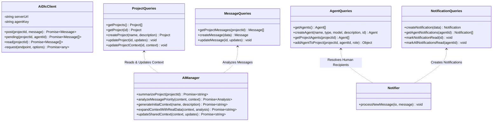

# Code Structure

## Build System

- **Type**: npm Workspaces Monorepo
- **Root Configuration**: `package.json` with workspace configuration:
  - `packages/sdk`
  - `packages/server`
  - `packages/web`
- **Root Scripts**:
  - `npm run dev`: Uses `concurrently` to run `@ai-dlc/sdk`, `@ai-dlc/server`, and `web` simultaneously in development mode.
  - `npm run build`: Runs `npm run build --workspaces --if-present`.
  - `npm run test`: Runs `npm run test --workspaces --if-present`.

---

## Module Hierarchy and Class Structure

---

## Existing Files Inventory

### Root Directory
- `package.json` — Root monorepo workspace definition and multi-package scripts.
- `README.md` — Project onboarding and quickstart guide.
- `arquitetura.md` — Original system architecture specification and roadmap.
- `agent-delegation-prompt.md` — Prompt template for external agent delegation.
- `simulate.js` / `simulate-bi.js` — Simulation scripts generating synthetic multi-agent conversations and test traffic.
- `clean-bi.js` — Reset and database seeding script for clean project initialization.
- `.env.example` — Environment variable template.

### `packages/server` (Backend Application)
- `packages/server/package.json` — Server package dependencies and build scripts.
- `packages/server/tsconfig.json` — TypeScript compiler options for Node/Express.
- `packages/server/src/index.ts` — Express application entry point, HTTP server creation, and Socket.IO initialization.
- `packages/server/src/db/connection.ts` — SQLite database initialization with schema execution.
- `packages/server/src/db/schema.sql` — Relational schema definition (tables: `projects`, `agents`, `project_agents`, `messages`, `notifications`, `decisions`).
- `packages/server/src/db/queries.ts` — Prepared SQL statement definitions and execution functions.
- `packages/server/src/routes/projects.ts` — Project CRUD, agent associations, and context expansion routes.
- `packages/server/src/routes/agents.ts` — Agent registration and retrieval routes.
- `packages/server/src/routes/messages.ts` — Message posting, reply handling, AI classification trigger, and shared context updates.
- `packages/server/src/routes/notifications.ts` — Notification listing, individual read, and batch read routes.
- `packages/server/src/routes/ai.ts` — AI project summarization endpoint.
- `packages/server/src/services/ai-manager.ts` — LangChain / Gemini LLM integration service.
- `packages/server/src/services/notifier.ts` — Blocker and question notification dispatcher.

### `packages/web` (Frontend Application)
- `packages/web/package.json` — Frontend package dependencies and Vite scripts.
- `packages/web/vite.config.ts` — Vite bundler configuration.
- `packages/web/tailwind.config.js` / `postcss.config.js` — Styling configurations.
- `packages/web/src/main.tsx` — React entry point with BrowserRouter.
- `packages/web/src/App.tsx` — Main application layout and routes definition.
- `packages/web/src/index.css` / `App.css` — Global styles and Tailwind utility declarations.
- `packages/web/src/pages/Dashboard.tsx` — Home dashboard displaying active projects and notifications.
- `packages/web/src/pages/MessagesView.tsx` — Project communication feed, real-time message stream, and blocker resolution interface.
- `packages/web/src/pages/ProjectView.tsx` — Project details, member agents, and shared wiki context viewer.
- `packages/web/src/components/AgentStatus.tsx` — Visual badge showing agent role and status.
- `packages/web/src/components/BlockerAlert.tsx` — Alert box highlighting unresolved blockers.
- `packages/web/src/components/MessageBubble.tsx` — Formatted message card with reply button, metadata, and thread context.
- `packages/web/src/components/NotificationBell.tsx` — Header notification counter and dropdown trigger.

### `packages/sdk` (Shared SDK)
- `packages/sdk/package.json` — SDK package definitions.
- `packages/sdk/tsconfig.json` — TypeScript compiler configuration for library distribution.
- `packages/sdk/src/index.ts` — `AiDlcClient` class export.

---

## Design Patterns

1. **Monorepo / Workspace Pattern**:
   - Isolates frontend, backend, and SDK packages with independent dependencies while allowing synchronized local development.
2. **Repository / Query Layer Pattern**:
   - Encapsulates all SQL statements in `db/queries.ts`, decoupling route controllers from raw database mechanics.
3. **Event-Driven Architecture (Observer Pattern)**:
   - Socket.IO broadcasts events (`new_message`, `message_updated`, `project_updated`, `notification`) to connected clients when state mutations occur.
4. **Anti-Hallucination Guardrail Pattern**:
   - System prompts in `ai-manager.ts` enforce strict factual boundaries (explicit instruction not to hallucinate tech stack until verified by source code scan).
5. **Human-in-the-Loop Governance Pattern**:
   - High-priority blocker messages automatically generate urgent notifications and halt automated assumptions until the human lead responds.
