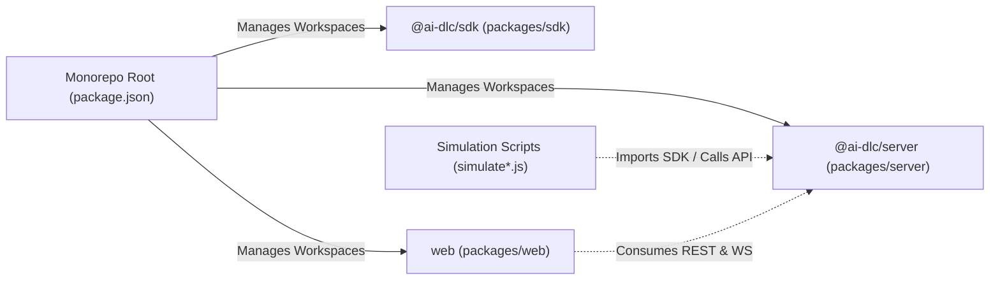

# Dependencies

## Internal Dependencies

### Text Alternative for Internal Dependencies
- `Root` manages `packages/sdk`, `packages/server`, and `packages/web` workspaces via npm.
- `web` communicates with `packages/server` over HTTP (port 3001) and Socket.IO.
- `packages/sdk` produces compiled TypeScript client code for external consumer agents.
- `simulate*.js` scripts issue API requests directly to `packages/server`.

---

## External Dependencies

### `@ai-dlc/server`
| Dependency | Version | Purpose |
| :--- | :--- | :--- |
| `express` | `^4.19.2` | Core web framework |
| `socket.io` | `^4.7.5` | Real-time WebSocket server |
| `better-sqlite3` | `^11.1.2` | SQLite embedded database engine |
| `@langchain/google-genai` | `^0.0.18` | Google Gemini LLM connector |
| `langchain` | `^0.2.6` | Prompt and chain management |
| `cors` | `^2.8.5` | Cross-origin resource sharing middleware |
| `dotenv` | `^16.4.5` | Environment variable loader |

### `web`
| Dependency | Version | Purpose |
| :--- | :--- | :--- |
| `react` | `^19.0.0` | UI component library |
| `react-dom` | `^19.0.0` | React DOM renderer |
| `react-router-dom` | `^7.0.2` | Routing & navigation |
| `socket.io-client` | `^4.7.5` | WebSocket client |
| `lucide-react` | `^0.468.0` | Icons |
| `tailwindcss` | `^3.4.16` | CSS styling |
| `vite` | `^6.0.3` | Bundler & dev server |

### `@ai-dlc/sdk`
| Dependency | Version | Purpose |
| :--- | :--- | :--- |
| `typescript` | `^5.4.5` | Static type checker & build compiler |
